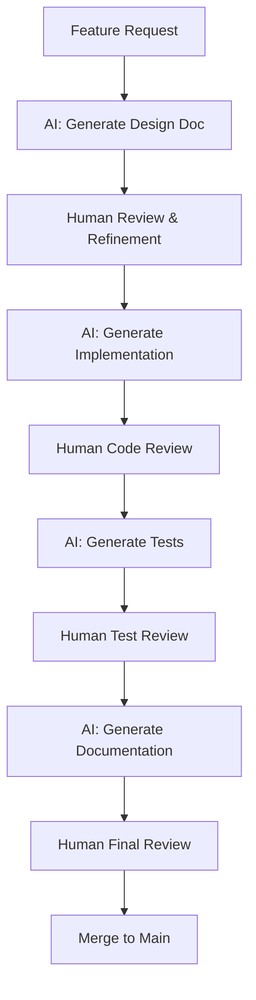

# AGENTS.md - GPT-Codex AI Agent Configuration

## Overview

This document defines the AI agent configurations, workflows, and best practices used in the Exousia project for AI-assisted development. Exousia leverages multiple AI agents (Claude, GPT Codex, and specialized coding assistants) to enhance development velocity, code quality, and system reliability.

## Project Context

**Exousia** is a declarative bootc image builder with:
- **FastAPI backend** (`api/`) for build orchestration and configuration management
- **Python tools** (`tools/`) for YAML transpilation, package validation, and build configuration
- **GitHub Actions CI/CD** (`.github/workflows/`) for automated builds, tests, and deployments
- **YAML-based configuration** (`yaml-definitions/`) for defining bootc images
- **Comprehensive test suite** (52+ tests covering API, tools, and integration)

### Project Structure

```
exousia/
├── .github/workflows/     # CI/CD pipeline definitions
│   └── build.yml         # Main build workflow
├── api/                  # FastAPI backend
│   ├── routers/         # API endpoint handlers
│   ├── services/        # Business logic services
│   ├── tests/           # API and integration tests
│   └── models.py        # Pydantic data models
├── tools/               # Python CLI tools
│   ├── resolve_build_config.py    # Build configuration resolver
│   ├── yaml-to-containerfile.py  # YAML → Containerfile transpiler
│   ├── package_loader.py          # Package definition loader
│   └── validate_installed_packages.py  # Package validator
├── yaml-definitions/    # YAML configuration files
├── custom-scripts/      # Shell scripts for builds
├── custom-tests/        # Bats integration tests
├── packages/           # Package definitions
│   ├── common/         # Base packages
│   ├── desktop-environments/
│   └── window-managers/
└── docs/               # Documentation
```

## Philosophy: AI-Augmented Development

Exousia embraces AI as a collaborative development partner rather than a replacement for human expertise. The goal is to:

- **Accelerate Development**: Leverage AI for rapid prototyping, boilerplate generation, and iterative refinement
- **Enhance Quality**: Use AI for code review, test generation, and documentation
- **Maintain Control**: Keep humans in the decision-making loop for architecture and critical logic
- **Preserve Transparency**: Document AI contributions and maintain clear attribution

### Test-Driven Development (TDD) - Core Principle

**ALL development work in Exousia MUST follow test-driven development practices:**

1. **Write Tests First**: Before implementing any feature or fix, write the test that validates the expected behavior
2. **Red-Green-Refactor**: Follow the TDD cycle:
   - **Red**: Write a failing test that defines the desired behavior
   - **Green**: Implement the minimal code needed to make the test pass
   - **Refactor**: Clean up the code while keeping tests passing
3. **No Untested Code**: Every new function, class, or feature must have corresponding tests
4. **Test Coverage**: Maintain minimum coverage thresholds (80% for API, 75% for tools)
5. **Integration Tests**: Complex features require both unit tests and integration tests

**Why TDD is mandatory:**
- Prevents regressions and ensures code correctness
- Provides living documentation of expected behavior
- Enables confident refactoring and continuous improvement
- Catches bugs early in the development cycle
- Facilitates AI-assisted development by providing clear validation criteria

## 🔴 HIGH PRIORITY: Continuous Quality Requirements

**These requirements MUST be met on EVERY branch before merging, regardless of the feature or fix being implemented.**

### Test Conformance (Mandatory)

Every branch must ensure:

#### 1. **Existing Tests Pass**
```bash
# Run all existing tests before starting work
python -m pytest api/tests/ -v
python -m pytest tools/test_*.py -v

# Bats tests for shell scripts
bats custom-tests/*.bats
```

#### 2. **New Tests for New Code**
- **New features**: Must include unit tests and integration tests
- **Bug fixes**: Must include regression test that would have caught the bug
- **API changes**: Must update API tests and include examples
- **Configuration changes**: Must validate with test cases

```bash
# Example: Adding new API endpoint
# REQUIRED: Add tests in api/tests/test_<feature>.py

# Example: Adding new YAML definition
# REQUIRED: Add validation tests
```

#### 3. **Test Coverage Requirements**
```bash
# Minimum coverage thresholds
pytest --cov=api --cov-report=term --cov-fail-under=80
pytest --cov=tools --cov-report=term --cov-fail-under=75
```

#### 4. **Linting & Type Checks**
```bash
# Python linting (must pass)
ruff check api/ tools/
pylint api/**/*.py tools/*.py

# Type checking
mypy api/ --strict

# Shell script linting
shellcheck custom-scripts/*
```

### Admin Tasks Checklist

Before opening a PR, complete this checklist:

- [ ] **All tests pass** (pytest, bats, integration tests)
- [ ] **Linting passes** (ruff, pylint, shellcheck)
- [ ] **Type checks pass** (mypy for Python code)
- [ ] **Documentation updated** (README, API docs, inline comments)
- [ ] **CHANGELOG.md updated** (if applicable)
- [ ] **API examples updated** (if API changes were made)
- [ ] **Security scan clean** (no new vulnerabilities introduced)
- [ ] **Performance tested** (if performance-critical code was changed)
- [ ] **Backwards compatibility verified** (or breaking changes documented)

## Common Development Scenarios (Exousia-Specific)

### Scenario 1: Adding New API Endpoint

```bash
# Step 1: Implement endpoint in api/routers/*.py
# Step 2: Add Pydantic models in api/models.py
# Step 3: Create tests in api/tests/test_*.py

# Required tests:
# - Happy path (200 OK)
# - Invalid input (400/422)
# - Auth failure (401/403)
# - Not found (404)
# - Server error handling (500)

# Step 4: Update API documentation
# - Add examples to api/README.md
# - Document request/response schemas

# Step 5: Run tests
pytest api/tests/test_<feature>.py -v

# Step 6: Verify coverage
pytest --cov=api.routers.<module> --cov-report=term
```

### Scenario 2: Modifying Build Pipeline

```bash
# Step 1: Update workflow in .github/workflows/build.yml
# Step 2: Update resolve_build_config.py if needed
# Step 3: Test locally with act or similar

# Required validations:
# - YAML syntax is valid
# - Environment variables are documented
# - Fallback logic is tested

# Step 4: Update documentation
# - Document new workflow inputs
# - Add examples to README.md and WEBHOOK_API.md

# Step 5: Create PR with test plan
```

### Scenario 3: Adding New Package Definition

```bash
# Step 1: Create YAML in packages/desktop-environments/ or packages/window-managers/
# Step 2: Validate YAML structure

# Required validations:
python tools/package_loader.py --validate packages/<category>/<name>.yml

# Step 3: Add to YamlSelectorService mappings (if needed)
# Step 4: Test auto-selection logic

pytest api/tests/test_yaml_selector.py -v

# Step 5: Document in README
```

### Scenario 4: Fixing Bug

```bash
# Step 1: Write failing test that reproduces bug
# Step 2: Implement fix
# Step 3: Verify test now passes
# Step 4: Add regression test to prevent recurrence

# Example test structure:
def test_bug_<issue_number>_<description>():
    """Regression test for bug #<issue_number>."""
    # Setup that triggers bug
    # Assert expected behavior (not buggy behavior)
```

### Scenario 5: Updating YAML Path Resolution

The project uses automatic YAML path resolution in `tools/resolve_build_config.py`:

1. **Exact path**: Try the path as specified
2. **yaml-definitions/ directory**: Prepend `yaml-definitions/` and try again
3. **Repo-wide search**: Use `find` to search entire repo (prefer yaml-definitions matches)
4. **Security**: Reject path traversal attempts (`..` or absolute paths)

When modifying this logic:
- Update tests in `api/tests/test_resolve_build_config.py`
- Ensure path traversal protection remains intact
- Document changes in `docs/WEBHOOK_API.md`

### Scenario 6: Modifying yaml-to-containerfile Transpiler

The YAML-to-Containerfile transpiler (`tools/yaml-to-containerfile.py`) is a critical component that converts BlueBuild-style YAML definitions into Dockerfile/Containerfile format:

```bash
# Step 1: Understand the transpiler architecture
# Key components:
# - BuildContext: Holds build configuration (image_type, fedora_version, enable_plymouth, enable_rke2, etc.)
# - ContainerfileGenerator: Main transpiler class
# - Module processors: _process_script_module, _process_files_module, _process_package_loader_module, etc.

# Step 2: Test existing functionality before changes
python3 tools/test_yaml_to_containerfile.py

# Step 3: When adding new conditionals:
# - Add to BuildContext dataclass
# - Extract from build config in main()
# - Implement evaluation in _evaluate_condition()
# - Update tests

# Example: Adding enable_feature conditional
# 1. Add to BuildContext:
@dataclass
class BuildContext:
    enable_feature: bool  # New field

# 2. Extract from config:
enable_feature = build_config.get("enable_feature", False)

# 3. Add evaluation:
if left == "enable_feature":
    return self.context.enable_feature == (right.lower() == "true")

# Step 4: Script rendering best practices:
# - Backslash continuations: _render_script_lines handles automatic semicolon insertion
# - Compound statements: Keywords like fi/done/esac get proper semicolons before next command
# - Heredocs: Supported but avoid when static files can be used (Hadolint compatibility)
# - Comments: Preserved verbatim in generated Containerfile

# Step 5: Required validations:
# - Generate test Containerfile: python3 tools/yaml-to-containerfile.py -c adnyeus.yml -o /tmp/test.txt
# - Run hadolint: hadolint /tmp/test.txt
# - Verify build: buildah build -f /tmp/test.txt
# - Run unit tests: python3 tools/test_yaml_to_containerfile.py
# - Test with conditions: Verify modules skip/include based on conditionals

# Step 6: Update documentation
# - Add examples to tools/README.md
# - Document new conditionals in YAML schema
```

**Important Transpiler Development Principles:**
- **Static files over heredocs**: Prefer COPY instructions with static files over RUN + heredoc
- **Hadolint validation**: All generated Containerfiles must pass Hadolint linting
- **Conditional evaluation**: Support image_type, enable_plymouth, enable_rke2, use_upstream_sway_config
- **Shell syntax**: Properly handle backslash continuations, compound statements, and quoted strings
- **Test coverage**: Add unit tests for any new module processors or conditionals
- **Error messages**: Provide clear error messages for invalid YAML or unsupported features

### Scenario 7: Working with RKE2 Integration

RKE2 (Rancher Kubernetes Engine 2) is integrated into Exousia as an optional bootc feature. When working with RKE2:

```bash
# Step 1: Enable RKE2 in your YAML definition
# Set enable_rke2: true in adnyeus.yml or your custom YAML

# Step 2: Use the rke2_ops Python module for all operations
# Located at tools/rke2_ops.py - DO NOT create shell scripts

# Available operations:
python3 tools/rke2_ops.py registry start    # Start local registry
python3 tools/rke2_ops.py vm build          # Build bootc disk image
python3 tools/rke2_ops.py vm create         # Create VM
python3 tools/rke2_ops.py vm start          # Start VM
python3 tools/rke2_ops.py vm status         # Check status
python3 tools/rke2_ops.py kubeconfig        # Get kubeconfig
python3 tools/rke2_ops.py quickstart        # Run all steps

# Or use Makefile targets:
make rke2-quickstart                        # Complete automated setup
make rke2-registry-start                    # Start registry
make rke2-vm-build                          # Build VM image
make rke2-vm-status                         # Check VM status

# Step 3: Test RKE2 integration
# Run the integration tests (now enabled by default)
ENABLE_RKE2=true bats custom-tests/image_content.bats

# Step 4: Required validations when modifying RKE2:
# - All 10 RKE2 integration tests must pass:
#   1. RKE2 binary installation
#   2. kubectl installation
#   3. Configuration files (registries.yaml, config.yaml)
#   4. Systemd drop-in directory
#   5. rke2_ops management tool
#   6. bootc kargs configuration
#   7. Data directory creation
#   8. MOTD configuration
#   9. Dependencies installation
#   10. Kubernetes repository configuration
# - Verify installation follows official RKE2 docs:
#   https://docs.rke2.io/install/methods
#   https://docs.rke2.io/install/quickstart
# - Test registry connectivity (192.168.122.1:5000)
# - Verify kubeconfig export works
# - Check systemd integration (rke2-server.service)

# Step 5: Update documentation
# - docs/RKE2_INTEGRATION.md for feature changes
# - docs/RKE2_BOOTC_SETUP.md for setup procedures
# - k8s/rke2/QUICKSTART.md for quick reference
# - README.md acknowledgements section
```

**Important RKE2 Development Principles:**
- **No shell scripts**: Use `tools/rke2_ops.py` for all RKE2 operations
- **Follow official docs**: Reference https://docs.rke2.io for installation methods
- **Test thoroughly**: RKE2 integration tests verify binary, config, systemd, and networking
- **Default enabled**: `enable_rke2` defaults to `true` in GitHub Actions and should remain so
- **Registry-first**: RKE2 uses local Podman registry on libvirt bridge (192.168.122.1:5000)
- **Bootc integration**: RKE2 is deployed via bootc image with proper kernel args and SELinux contexts
- **Prefer static files**: Use static repository files (custom-repos/*.repo) over dynamically generated heredocs
- **Hadolint compatibility**: Avoid shell heredocs in Containerfile generation; they confuse Hadolint's parser

### Scenario 8: Flatpak and Flathub Configuration

Exousia uses Flatpak for application distribution and the Flathub remote for package sources. The project uses BlueBuild's `default-flatpaks` module for boot-time installation.

```bash
# Step 1: Configure Flathub remote at build time
# The remote is added via script module in adnyeus.yml (and other image definitions)
# Command: flatpak remote-add --if-not-exists flathub https://dl.flathub.org/repo/flathub.flatpakrepo

# Step 2: Define flatpaks in packages/common/flatpaks.yml
# This file uses the BlueBuild default-flatpaks module format
# Example:
---
type: default-flatpaks
notify: true
system:
  install:
    - com.visualstudio.code
    - org.mozilla.firefox
    - io.github.zen_browser.zen

# Step 3: Include flatpaks module in image definition
# Add to modules section:
- from-file: packages/common/flatpaks.yml

# Step 4: Verify flatpak configuration
# At build time (in tests):
buildah run $CONTAINER -- flatpak remote-list
buildah run $CONTAINER -- flatpak remote-list | grep -i flathub

# At runtime:
flatpak remote-list
flatpak list  # List installed applications
flatpak update  # Update all flatpaks

# Step 5: Test flatpak installation
# Run integration tests:
bats custom-tests/image_content.bats -f "Flathub remote"
```

**Important Flatpak Development Principles:**
- **Build-time remote setup**: Add Flathub remote at build time for testing verification
- **Boot-time installation**: Use `default-flatpaks` module for actual package installation
- **Correct URL**: Use `https://dl.flathub.org/repo/flathub.flatpakrepo` (not https://flathub.org/repo/)
- **System-level install**: Use `--system` flag for system-wide availability
- **No RPM duplicates**: Remove RPM versions of packages that will be installed as flatpaks (e.g., Firefox)
- **Service enablement**: The `default-flatpaks` module automatically creates and enables systemd services
- **Test coverage**: Verify remote configuration and service enablement in tests

**Key Files:**
- `adnyeus.yml:136-155` - Flathub remote setup and flatpaks module inclusion
- `packages/common/flatpaks.yml` - Flatpak package definitions
- `custom-tests/image_content.bats` - Flatpak integration tests

**References:**
- [BlueBuild default-flatpaks Module](https://blue-build.org/reference/modules/default-flatpaks/)
- [Flathub Setup Guide](https://flathub.org/setup)

### Scenario 9: Chezmoi Dotfiles Management

Exousia uses the BlueBuild `chezmoi` module for automated dotfiles management. The module handles binary installation, systemd service creation, and automatic updates.

```bash
# Step 1: Add chezmoi module to image definition
# Add to modules section in YAML:
- type: chezmoi
  repository: "https://github.com/borninthedark/dotfiles"
  all-users: true
  file-conflict-policy: skip
  run-every: "1d"
  wait-after-boot: "5m"

# Step 2: Enable chezmoi systemd user services
# Add to systemd module:
- type: systemd
  user:
    enabled:
      - chezmoi-init.service
      - chezmoi-update.timer

# Step 3: DO NOT add chezmoi to package lists
# The BlueBuild module downloads and installs the binary automatically
# Never add chezmoi to packages/common/base.yml or other package lists

# Step 4: Verify chezmoi installation
# Check binary installation:
which chezmoi  # Should be /usr/bin/chezmoi
chezmoi --version

# Check systemd services:
systemctl --user status chezmoi-init.service
systemctl --user status chezmoi-update.timer

# Step 5: Test chezmoi integration
# Run the 7 chezmoi-specific tests:
bats custom-tests/image_content.bats -f "chezmoi"

# Expected tests:
# 1. chezmoi binary is installed at /usr/bin/chezmoi
# 2. chezmoi is executable
# 3. chezmoi --version works
# 4. chezmoi-init.service exists
# 5. chezmoi-update.service exists
# 6. chezmoi-update.timer exists
# 7. chezmoi is NOT installed as RPM package

# Step 6: Manual operations (runtime)
# Initialize dotfiles manually:
chezmoi init --apply https://github.com/borninthedark/dotfiles

# Update dotfiles:
chezmoi update

# Check managed files:
chezmoi managed

# View what would be applied:
chezmoi diff
```

**Important Chezmoi Development Principles:**
- **Module-based installation**: Never install chezmoi as RPM package - the BlueBuild module handles it
- **Binary location**: chezmoi is installed to `/usr/bin/chezmoi` by the module
- **Systemd services**: The module creates `chezmoi-init.service` and `chezmoi-update.timer` user services
- **Global enablement**: Use `systemctl --global enable` via BlueBuild systemd module for all users
- **Conflict policy**: Use `skip` to allow local changes, or `replace` to always sync with repository
- **Test coverage**: Verify binary installation, service creation, and absence of RPM package
- **Documentation**: See `docs/CHEZMOI_INTEGRATION.md` for comprehensive guide

**Key Files:**
- `adnyeus.yml:157-165` - Chezmoi module configuration
- `adnyeus.yml:330-333` - Systemd user service enablement
- `yaml-definitions/sway-atomic.yml` - Chezmoi configuration for Sway Atomic
- `yaml-definitions/sway-bootc.yml` - Chezmoi configuration for Sway Bootc
- `yaml-definitions/fedora-kinoite.yml` - Chezmoi configuration for Fedora Kinoite
- `docs/CHEZMOI_INTEGRATION.md` - Comprehensive chezmoi documentation
- `custom-tests/image_content.bats` - Chezmoi integration tests

**Images with Chezmoi:**
- ✅ Adnyeus (`adnyeus.yml`)
- ✅ Sway Atomic (`yaml-definitions/sway-atomic.yml`)
- ✅ Sway Bootc (`yaml-definitions/sway-bootc.yml`)
- ✅ Fedora Kinoite (`yaml-definitions/fedora-kinoite.yml`)
- ❌ RKE2 bootc (minimal server image, no desktop environment)

**References:**
- [BlueBuild chezmoi Module](https://blue-build.org/reference/modules/chezmoi/)
- [chezmoi Official Documentation](https://www.chezmoi.io/)
- [Exousia Dotfiles Repository](https://github.com/borninthedark/dotfiles)

### Scenario 10: Implementing ZFS Filesystem Support

ZFS (OpenZFS) is a planned feature for Exousia that provides advanced filesystem capabilities including copy-on-write, snapshots, compression, and RAID-Z. This scenario documents the implementation plan.

**Challenge**: ZFS requires kernel modules compiled against the exact running kernel. On Fedora, only DKMS packages are available (no pre-built kmods) because Fedora doesn't provide a stable kABI.

#### ZFS Kernel Compatibility Matrix

| ZFS Version | Max Kernel | Notes |
|-------------|------------|-------|
| 2.3.3 | 6.15.x | Current stable |
| 2.3.2 | 6.14.x | Previous stable |
| 2.3.0 | 6.12.x | Older stable |

**Important**: Fedora's rapid kernel updates often outpace ZFS compatibility. Monitor [openzfs/zfs issues](https://github.com/openzfs/zfs/issues) for kernel support status.

#### Implementation Approach: Build-Time DKMS Compilation

```bash
# Step 1: Create ZFS repository file
# File: custom-repos/zfs.repo

[zfs]
name=OpenZFS for Fedora $releasever
baseurl=https://zfsonlinux.org/fedora/$releasever/$basearch/
enabled=1
metadata_expire=7d
gpgcheck=1
gpgkey=file:///etc/pki/rpm-gpg/RPM-GPG-KEY-openzfs

[zfs-testing]
name=OpenZFS for Fedora $releasever - Testing
baseurl=https://zfsonlinux.org/fedora/$releasever/testing/$basearch/
enabled=0
metadata_expire=1d
gpgcheck=1
gpgkey=file:///etc/pki/rpm-gpg/RPM-GPG-KEY-openzfs
```

#### Step 2: Create Package Definition

```bash
# File: packages/features/zfs.yml

metadata:
  name: zfs
  type: feature
  description: OpenZFS filesystem and volume manager support
  kernel_module: true
  requires_dkms: true

# Build dependencies (removed after compilation to save ~500MB)
build_dependencies:
  - kernel-devel
  - dkms
  - gcc
  - make
  - autoconf
  - automake
  - libtool
  - libtirpc-devel
  - libblkid-devel
  - libuuid-devel
  - libudev-devel
  - openssl-devel
  - zlib-devel
  - libaio-devel
  - libattr-devel
  - elfutils-libelf-devel
  - python3-devel
  - python3-cffi
  - libffi-devel
  - python3-packaging

# ZFS packages (kept in image)
core:
  - zfs

# Optional packages
optional:
  - zfs-dracut  # For ZFS in initramfs

# Conflicts
conflicts:
  - zfs-fuse  # FUSE-based ZFS conflicts with kernel module
```

#### Step 3: Add Build Modules to adnyeus.yml

```yaml
# Build configuration - add enable_zfs flag
build:
  enable_plymouth: true
  enable_rke2: true
  enable_zfs: false  # NEW: ZFS filesystem support (default: disabled)

modules:
  # ... existing modules ...

  # ============================================================================
  # ZFS Filesystem Support (optional, enabled via build.enable_zfs)
  # https://openzfs.github.io/openzfs-docs/Getting%20Started/Fedora/
  # ============================================================================

  # ZFS Step 1: Add repository and import GPG key
  - type: files
    condition: enable_zfs == true
    files:
      - src: custom-repos/zfs.repo
        dst: /etc/yum.repos.d/zfs.repo
        mode: "0644"

  - type: script
    condition: enable_zfs == true
    scripts:
      - |
        set -euxo pipefail
        rpm --import https://zfsonlinux.org/fedora/RPM-GPG-KEY-openzfs
        dnf remove -y zfs-fuse || true
        echo "✓ ZFS repository configured"

  # ZFS Step 2: Install build dependencies
  - type: script
    condition: enable_zfs == true
    scripts:
      - |
        set -euxo pipefail
        KVER=$(rpm -q kernel-core --qf '%{VERSION}-%{RELEASE}.%{ARCH}\n' | tail -1)
        echo "Building ZFS for kernel: $KVER"
        dnf install -y kernel-devel-${KVER} || dnf install -y kernel-devel
        dnf install -y dkms gcc make autoconf automake libtool \
          libtirpc-devel libblkid-devel libuuid-devel libudev-devel \
          openssl-devel zlib-devel libaio-devel libattr-devel \
          elfutils-libelf-devel python3-devel python3-cffi \
          libffi-devel python3-packaging
        echo "✓ ZFS build dependencies installed"

  # ZFS Step 3: Install ZFS (triggers DKMS compilation)
  - type: script
    condition: enable_zfs == true
    scripts:
      - |
        set -euxo pipefail
        dnf install -y zfs
        KVER=$(rpm -q kernel-core --qf '%{VERSION}-%{RELEASE}.%{ARCH}\n' | tail -1)
        if dkms status | grep -q "zfs.*installed"; then
          echo "✓ ZFS DKMS module built for kernel $KVER"
        else
          echo "⚠ ZFS DKMS build may have failed"
          dkms status
        fi

  # ZFS Step 4: Configure services and rebuild initramfs
  - type: script
    condition: enable_zfs == true
    scripts:
      - |
        set -euxo pipefail
        # Enable ZFS services
        systemctl enable zfs-import-cache.service || true
        systemctl enable zfs-import-scan.service || true
        systemctl enable zfs-mount.service || true
        systemctl enable zfs.target || true
        mkdir -p /etc/zfs

        # Add ZFS to dracut
        mkdir -p /usr/lib/dracut/dracut.conf.d
        echo 'add_dracutmodules+=" zfs "' > /usr/lib/dracut/dracut.conf.d/zfs.conf

        # Rebuild initramfs
        KVER=$(rpm -q kernel-core --qf '%{VERSION}-%{RELEASE}.%{ARCH}\n' | tail -1)
        dracut -f --kver ${KVER}
        echo "✓ ZFS services enabled and initramfs rebuilt"

  # ZFS Step 5: Remove build dependencies (saves ~500MB)
  - type: script
    condition: enable_zfs == true
    scripts:
      - |
        set -euxo pipefail
        dnf remove -y gcc make autoconf automake libtool \
          libtirpc-devel libblkid-devel libuuid-devel libudev-devel \
          openssl-devel zlib-devel libaio-devel libattr-devel \
          elfutils-libelf-devel python3-devel python3-cffi \
          libffi-devel python3-packaging || true
        dnf clean all
        echo "✓ Build dependencies removed"

  # ZFS Step 6: Validation
  - type: script
    condition: enable_zfs == true
    scripts:
      - |
        echo "=== ZFS Installation Summary ==="
        rpm -q zfs && echo "✓ ZFS package installed" || echo "✗ ZFS package missing"
        dkms status | grep zfs || echo "⚠ No ZFS DKMS modules found"
        which zpool && echo "✓ zpool available" || echo "✗ zpool missing"
        which zfs && echo "✓ zfs available" || echo "✗ zfs missing"
        systemctl is-enabled zfs.target && echo "✓ zfs.target enabled" || true
        echo "=== ZFS installation complete ==="
```

#### Step 4: Add Bats Tests

```bash
# File: custom-tests/zfs.bats

#!/usr/bin/env bats

load test_helper

# Skip all tests if ZFS is not enabled
setup() {
    if [ "${ENABLE_ZFS:-false}" != "true" ]; then
        skip "ZFS not enabled (set ENABLE_ZFS=true)"
    fi
}

@test "ZFS package is installed" {
    run buildah run $CONTAINER rpm -q zfs
    assert_success
}

@test "zpool command is available" {
    run buildah run $CONTAINER which zpool
    assert_success
}

@test "zfs command is available" {
    run buildah run $CONTAINER which zfs
    assert_success
}

@test "ZFS DKMS module is built" {
    run buildah run $CONTAINER dkms status
    assert_output --partial "zfs"
    assert_output --partial "installed"
}

@test "ZFS services are enabled" {
    run buildah run $CONTAINER systemctl is-enabled zfs.target
    assert_success
}

@test "ZFS dracut module is configured" {
    run buildah run $CONTAINER test -f /usr/lib/dracut/dracut.conf.d/zfs.conf
    assert_success
}

@test "zfs-fuse is NOT installed (conflicts)" {
    run buildah run $CONTAINER rpm -q zfs-fuse
    assert_failure
}
```

#### Kernel Pinning for ZFS Stability

To ensure ZFS compatibility with rapid Fedora kernel updates:

**Option 1: Use LTS Kernel from COPR**
```yaml
- type: script
  condition: enable_zfs == true
  scripts:
    - |
      # Install LTS kernel for ZFS stability
      dnf copr enable -y kwizart/kernel-longterm-6.12
      dnf install -y --allowerasing kernel-longterm kernel-longterm-devel
```

**Option 2: Exclude Kernel from Updates**
```bash
# File: custom-configs/dnf/zfs-kernel-protect.conf
# Prevent automatic kernel updates when ZFS is installed
excludepkgs=kernel*
```

#### Important Considerations

1. **Root on ZFS NOT recommended**: Conflicts with bootc's OSTree model. Use ZFS for data volumes only.

2. **Kernel updates may break ZFS**: DKMS will attempt to rebuild, but new kernels may not be supported yet.

3. **Image size impact**: ~200-500MB depending on whether build deps are removed.

4. **Testing in VM required**: ZFS kernel modules cannot be tested in container builds.

5. **ZFS with Podman storage**: Can use ZFS datasets for container storage:
   ```bash
   zfs create tank/containers
   zfs set mountpoint=/var/lib/containers tank/containers
   # Configure Podman: driver = "zfs" in /etc/containers/storage.conf
   ```

#### Development Workflow

```bash
# Step 1: Create feature files
mkdir -p packages/features
# Create zfs.yml and custom-repos/zfs.repo as shown above

# Step 2: Add to adnyeus.yml with enable_zfs condition

# Step 3: Test build locally
python3 tools/yaml-to-containerfile.py -c adnyeus.yml \
  --enable-zfs -o /tmp/Containerfile-zfs
buildah build -f /tmp/Containerfile-zfs -t exousia-zfs:test

# Step 4: Run tests
ENABLE_ZFS=true bats custom-tests/zfs.bats

# Step 5: Test in VM
# Use bootc-image-builder to create disk image and test ZFS operations

# Step 6: Document and commit
git add packages/features/zfs.yml custom-repos/zfs.repo custom-tests/zfs.bats
git commit -m "feat: Add ZFS filesystem support as optional feature"
```

#### References

- [Building ZFS — OpenZFS Documentation](https://openzfs.github.io/openzfs-docs/Developer%20Resources/Building%20ZFS.html)
- [Fedora — OpenZFS Documentation](https://openzfs.github.io/openzfs-docs/Getting%20Started/Fedora/index.html)
- [ZFS Kernel Compatibility Issues](https://github.com/openzfs/zfs/issues/17265)
- [ZFS Autobuild for CoreOS](https://github.com/kainzilla/zfs-autobuild)
- [DKMS vs kmod Guide](https://klarasystems.com/articles/dkms-vs-kmod-the-essential-guide-for-zfs-on-linux/)

## Common Pitfalls & Lessons Learned

### Containerfile Generation

**Issue**: Hadolint fails with "unexpected '[' expecting Dockerfile directive"
**Cause**: Shell heredocs in RUN commands confuse Hadolint's parser
**Solution**: Use static files (COPY) instead of heredocs. Example:
```yaml
# ❌ BAD: Heredoc in RUN command
- type: script
  scripts:
    - |
      cat <<'EOF' > /etc/yum.repos.d/kubernetes.repo
      [kubernetes]
      name=Kubernetes
      baseurl=https://pkgs.k8s.io/core:/stable:/v1.34/rpm/
      EOF

# ✅ GOOD: Static file with COPY
- type: files
  files:
    - src: custom-repos/kubernetes.repo
      dst: /etc/yum.repos.d/
      mode: "0644"
```

**Issue**: "RUN: command not found" errors in generated Containerfile
**Cause**: Multiple RUN commands being incorrectly merged into a single command
**Solution**: Verify each script module generates a separate RUN instruction. Check module separation in YAML.

**Issue**: Backslash continuation syntax errors (`\;`)
**Cause**: Script renderer adding semicolons after backslash continuations
**Solution**: The transpiler now detects lines ending with `\` and skips semicolon insertion

**Issue**: "unexpected tokens after compound command" (SC1141)
**Cause**: Missing semicolons after fi/done/esac before next command
**Solution**: The transpiler now adds semicolons after compound statement enders (fi, done, esac)

### Directory Creation in Images

**Issue**: `/mnt` directory creation failures in bootc images
**Cause**: Attempting to create system directories that are guaranteed to exist
**Solution**: Don't create standard system directories (/mnt, /tmp, /var, etc.). Only create application-specific subdirectories if needed at build time.

**Best Practice**: For mount points and runtime directories, let cloud-init or systemd tmpfiles.d handle creation at runtime.

### Package Management

**Issue**: Package file conflicts (e.g., swaylock vs swaylock-effects)
**Cause**: Not removing conflicting packages before installation
**Solution**: Use packages/common/remove.yml to remove conflicting packages. The package-loader module processes removals BEFORE installations.

**Issue**: Missing COPR repositories for specialized packages
**Cause**: Repository not added to custom-repos/ or not configured in tools/copr_manager.py
**Solution**:
1. Add `.repo` file to custom-repos/
2. Register in tools/copr_manager.py COPR_REPOS dict
3. Test with package-loader module

### Sway Configuration

**Issue**: Sway configs not being applied correctly
**Cause**: Wrong sway-config package installed or config path mismatch
**Solution**: Exousia uses `sway-config-minimal` which provides:
- Minimal dependencies for headless/container builds
- Compatible with both desktop and server deployments
- `sway-config-upstream` is removed via packages/common/remove.yml

**Directory structure**:
- Custom configs: `custom-configs/sway/` → `/etc/sway/`
- Config snippets: `custom-configs/sway/config.d/` → `/etc/sway/config.d/`
- Session files: `custom-configs/sway/sway.desktop` → `/usr/share/wayland-sessions/`

See [Fedora Sericea Configuration Guide](https://docs.fedoraproject.org/en-US/fedora-sericea/configuration-guide/) for the layered config system.

### RKE2 Configuration Path

**Issue**: RKE2 config files not found at expected location
**Cause**: Config directory structure mismatch
**Solution**: RKE2 configs must be at `custom-configs/rancher/rke2/` to deploy to `/etc/rancher/rke2/`:
- `custom-configs/rancher/rke2/config.yaml` → `/etc/rancher/rke2/config.yaml`
- `custom-configs/rancher/rke2/registries.yaml` → `/etc/rancher/rke2/registries.yaml`

Note: The motd file is copied separately via adnyeus.yml to `/etc/motd`.

### Testing

**Issue**: Tests pass locally but fail in CI
**Cause**: Different default values for build flags (enable_rke2, enable_plymouth, etc.)
**Solution**: Check .github/workflows/build.yml for default input values. Ensure tests account for both enabled and disabled states.

**Issue**: Bats tests skip unexpectedly
**Cause**: Helper functions like is_rke2_enabled() checking environment variables
**Solution**: Set ENABLE_RKE2=true when running tests that depend on RKE2 features

## Key Project Features

### Automatic YAML Path Resolution (Added: 2025-12-04)

The build system automatically resolves YAML configuration paths:
- Users can specify just a filename: `sway-bootc.yml`
- System searches: exact path → yaml-definitions/ → entire repo
- Prevents path traversal attacks
- Documented in `docs/WEBHOOK_API.md`

### Cron Schedule (Updated: 2025-12-04)

- Nightly builds run at 3:10 AM UTC
- Schedule: `10 3 * * *` in `.github/workflows/build.yml`

### Build Status Badges

The project uses custom badges in README.md:
- **Reiatsu** (霊圧, spiritual pressure) - Build status
- **Last Build** - Dynamic badge showing OS version and desktop environment
- **Code Quality** - Workflow status
- **Highly Experimental** - Warning badge

Code coverage badge was removed as of 2025-12-04.

### Documentation Requirements

Every significant change requires:

#### 1. **Code-Level Documentation**
```python
# Example: All new functions/classes need docstrings
def new_feature(param: str) -> dict:
    """
    Brief description of what this does.

    Args:
        param: Description of parameter

    Returns:
        Description of return value

    Raises:
        ValueError: When param is invalid
    """
```

#### 2. **User-Facing Documentation**
- Update README.md if user-visible behavior changes
- Update API documentation in `api/README.md`
- Update webhook examples in `docs/WEBHOOK_API.md`
- Add examples for new features

#### 3. **Developer Documentation**
- Update `tools/README.md` for new tools
- Document new configuration options
- Update architecture docs if structure changes

### Quick Validation Script

Use this before committing:

```bash
#!/bin/bash
# .git/hooks/pre-commit or run manually

echo "🔍 Running quality checks..."

# 1. Run tests
echo "📋 Running tests..."
pytest api/tests/ -q || exit 1
pytest tools/test_*.py -q || exit 1

# 2. Linting
echo "🔧 Running linters..."
ruff check api/ tools/ || exit 1
shellcheck custom-scripts/* || exit 1

# 3. Type checking
echo "📐 Type checking..."
mypy api/ || exit 1

# 4. Check for common issues
echo "🔎 Security scan..."
semgrep --config auto api/ || exit 1

echo "✅ All quality checks passed!"
```

### AI Agent Responsibilities

When using AI agents (Claude, Codex, etc.) for development:

1. **Always run tests after AI-generated changes**
2. **Review all AI-generated code for security issues**
3. **Ensure AI-generated code has proper error handling**
4. **Add tests for AI-generated functionality**
5. **Update documentation for AI-generated features**

### Exemptions

The only valid exemptions from these requirements:

- **Documentation-only changes** (README updates, typo fixes)
- **CI/CD configuration** (workflow files only, must still be tested)
- **Emergency hotfixes** (must be followed up with tests in next commit)

All other changes require full compliance with quality requirements.

---

## AI Agent Roles

### Primary Development Agents

#### 1. **Claude (Anthropic)** - Architecture & Documentation Specialist
- **Primary Use Cases**:
  - System architecture design and review
  - Comprehensive documentation generation
  - Complex code refactoring and optimization
  - Security analysis and vulnerability assessment
  - Test suite design and implementation
- **Strengths**: Long context window, strong reasoning, excellent documentation quality
- **Integration Points**: Direct API access, VS Code extensions, CLI tools

#### 2. **GPT-4 / GPT Codex (OpenAI)** - Code Generation & Claude's Assistant
- **Primary Use Cases**:
  - Rapid code generation and prototyping
  - Debugging assistance and error resolution
  - API integration and library usage
  - Script automation and tooling
  - Pattern recognition in codebases
  - **Acting as Claude's assistant for parallel task execution**
- **Strengths**: Fast iteration, broad language support, strong debugging capabilities
- **Integration Points**: GitHub Copilot, OpenAI API, VS Code extensions
- **Assistant Role**: GPT Codex can handle delegated tasks from Claude:
  - Running tests and reporting results
  - Code formatting and linting
  - Simple refactoring tasks
  - Documentation updates
  - File search and codebase exploration

#### 3. **GitHub Copilot** - Real-time Code Assistance
- **Primary Use Cases**:
  - Inline code completion
  - Function and class generation
  - Comment-to-code translation
  - Boilerplate reduction
- **Strengths**: IDE integration, context-aware suggestions, real-time feedback
- **Integration Points**: Native IDE plugins (VS Code, JetBrains, Neovim)

### Specialized Agents

#### 4. **Shell Script Assistant** - Automation & DevOps
- **Primary Use Cases**:
  - CI/CD pipeline scripts
  - Build automation
  - System administration tasks
  - Container orchestration scripts
- **Model**: Claude or GPT-4 with shell scripting focus
- **Quality Gates**: ShellCheck validation, Bats testing

#### 5. **Documentation Agent** - Technical Writing
- **Primary Use Cases**:
  - README generation and maintenance
  - API documentation
  - User guides and tutorials
  - Architecture decision records (ADRs)
- **Model**: Claude (preferred for long-form content)
- **Output Formats**: Markdown, reStructuredText, AsciiDoc

#### 6. **Test Generation Agent** - Quality Assurance
- **Primary Use Cases**:
  - Unit test generation
  - Integration test scaffolding
  - Test data creation
  - Edge case identification
- **Model**: GPT-4 or Claude
- **Frameworks**: Bats, pytest, Jest, Go testing

### Claude-Codex Collaborative Workflow

Claude and GPT Codex work together with complementary strengths:

```
┌─────────────────────────────────────────────────────────────┐
│                     Claude (Lead Agent)                      │
│  ┌─────────────────────────────────────────────────────┐    │
│  │  • Architecture decisions                            │    │
│  │  • Complex reasoning and planning                    │    │
│  │  • Documentation and comprehensive analysis          │    │
│  │  • Code review and security assessment               │    │
│  └─────────────────────────────────────────────────────┘    │
│                            │                                 │
│                    Delegates Tasks                           │
│                            ▼                                 │
│  ┌─────────────────────────────────────────────────────┐    │
│  │              GPT Codex (Assistant)                   │    │
│  │  • Rapid code generation                             │    │
│  │  • Test execution and reporting                      │    │
│  │  • File operations and refactoring                   │    │
│  │  • Quick iterations on implementation                │    │
│  └─────────────────────────────────────────────────────┘    │
│                            │                                 │
│                    Reports Results                           │
│                            ▼                                 │
│  ┌─────────────────────────────────────────────────────┐    │
│  │                Human Review                          │    │
│  │  • Final approval                                    │    │
│  │  • Merge decisions                                   │    │
│  │  • Production deployment                             │    │
│  └─────────────────────────────────────────────────────┘    │
└─────────────────────────────────────────────────────────────┘
```

**Task Delegation Examples**:
- Claude plans feature implementation → Codex executes file changes
- Claude identifies test requirements → Codex runs test suite
- Claude designs documentation structure → Codex generates content
- Claude reviews security → Codex applies fixes

## AI-Assisted Workflows

### 1. Feature Development Workflow



**Process**:
1. Human provides feature requirements
2. AI agent generates design document with Claude
3. Human reviews and refines architecture
4. AI generates initial implementation with GPT-4/Copilot
5. Human reviews code for correctness and security
6. AI generates comprehensive test suite
7. Human validates test coverage and edge cases
8. AI generates user-facing documentation
9. Human performs final review and approval

### 2. Bug Fix Workflow

```bash
# Step 1: AI analyzes error logs and stack traces
$ ai-debug analyze --logs error.log --context src/

# Step 2: AI suggests root cause and fixes
$ ai-debug suggest --issue "authentication failure"

# Step 3: Human reviews and selects approach

# Step 4: AI generates fix with tests
$ ai-debug fix --apply --test

# Step 5: Human validates fix in development environment
```

### 3. Refactoring Workflow

```bash
# Step 1: AI analyzes codebase for improvements
$ ai-refactor analyze --target src/legacy/ --metrics complexity,duplication

# Step 2: AI generates refactoring plan
$ ai-refactor plan --priority high

# Step 3: Human approves plan

# Step 4: AI performs incremental refactoring
$ ai-refactor apply --incremental --with-tests

# Step 5: Human reviews each increment before proceeding
```

### 4. Documentation Workflow

```bash
# Step 1: AI scans codebase for undocumented areas
$ ai-docs scan --missing --outdated

# Step 2: AI generates documentation drafts
$ ai-docs generate --format markdown --target docs/

# Step 3: Human reviews and enhances with domain expertise

# Step 4: AI updates README and cross-references
$ ai-docs update-readme --auto-link
```

## AI Integration Points

### Development Environment

#### VS Code Configuration
```json
{
  "github.copilot.enable": {
    "*": true,
    "yaml": true,
    "markdown": true,
    "shellscript": true
  },
  "claude.apiKey": "${CLAUDE_API_KEY}",
  "claude.model": "claude-sonnet-4-5-20250929",
  "openai.apiKey": "${OPENAI_API_KEY}"
}
```

#### CLI Tools
```bash
# Install AI development assistants
pip install anthropic openai
npm install -g @anthropic-ai/sdk

# Configure environment
export CLAUDE_API_KEY="your-key-here"
export OPENAI_API_KEY="your-key-here"
```

### CI/CD Integration

#### GitHub Actions AI Workflows

```yaml
# .github/workflows/ai-review.yml
name: AI Code Review
on: [pull_request]

jobs:
  ai-review:
    runs-on: ubuntu-latest
    steps:
      - uses: actions/checkout@v4
      
      - name: AI Security Scan
        uses: anthropic/claude-action@v1
        with:
          model: claude-sonnet-4-5-20250929
          task: security-review
          files: "**/*.{py,js,sh,go}"
          
      - name: AI Code Quality Check
        run: |
          ai-review --model gpt-4 --standards pep8,shellcheck
          
      - name: Post Review Comment
        uses: actions/github-script@v7
        with:
          script: |
            github.rest.issues.createComment({
              issue_number: context.issue.number,
              owner: context.repo.owner,
              repo: context.repo.repo,
              body: process.env.AI_REVIEW_OUTPUT
            })
```

### API Usage Patterns

#### Claude API Example
```python
import anthropic

client = anthropic.Anthropic(api_key=os.environ.get("CLAUDE_API_KEY"))

def generate_tests(source_code: str, language: str) -> str:
    """Generate comprehensive test suite using Claude."""
    message = client.messages.create(
        model="claude-sonnet-4-5-20250929",
        max_tokens=4096,
        messages=[{
            "role": "user",
            "content": f"""Generate a comprehensive test suite for this {language} code:

```{language}
{source_code}
```

Include:
- Unit tests for all functions
- Edge case coverage
- Error handling tests
- Integration test stubs
"""
        }]
    )
    return message.content[0].text
```

#### OpenAI API Example
```python
import openai

def debug_error(error_message: str, code_context: str) -> str:
    """Use GPT-4 to analyze and suggest fixes for errors."""
    response = openai.ChatCompletion.create(
        model="gpt-4",
        messages=[
            {"role": "system", "content": "You are an expert debugger."},
            {"role": "user", "content": f"""
Error: {error_message}

Code Context:
{code_context}

Provide:
1. Root cause analysis
2. Suggested fix with code
3. Prevention strategies
"""}
        ]
    )
    return response.choices[0].message.content
```

## Quality Gates & Validation

### AI-Generated Code Standards

All AI-generated code must pass:

1. **Linting**: Language-specific linters (pylint, eslint, shellcheck)
2. **Testing**: Minimum 80% test coverage
3. **Security**: Vulnerability scanning with Trivy/Semgrep
4. **Human Review**: Mandatory code review by maintainer
5. **Documentation**: Inline comments and user documentation

### Review Checklist for AI Contributions

- [ ] Code follows project style guidelines
- [ ] No hardcoded secrets or credentials
- [ ] Error handling is comprehensive
- [ ] Tests cover happy path and edge cases
- [ ] Documentation is clear and accurate
- [ ] No obvious security vulnerabilities
- [ ] Performance considerations addressed
- [ ] Dependencies are justified and minimal

## Best Practices

### Prompting Guidelines

#### Effective Prompts
```
✅ GOOD: "Generate a bash function that validates YAML files using yq, 
includes error handling, and returns exit code 0 on success. Add inline 
comments explaining each step."

❌ BAD: "Make a YAML validator"
```

#### Context Provision
```bash
# Provide relevant context for better results
$ cat src/config.py | ai-assist refactor --context "
This config loader needs to:
- Support environment variable overrides
- Validate required fields
- Handle missing files gracefully
- Use type hints
"
```

#### Iterative Refinement
```
1st prompt: "Create a Containerfile for a Python FastAPI app"
2nd prompt: "Add multi-stage build to reduce image size"
3rd prompt: "Include security scanning and non-root user"
4th prompt: "Optimize layer caching for faster rebuilds"
```

### Attribution & Transparency

#### Code Comments
```python
# AI-generated with Claude Sonnet 4.5 (2025-12-13)
# Prompt: "Create async function to fetch and parse remote YAML configs"
# Human modifications: Added retry logic and custom timeout handling
async def fetch_remote_config(url: str, timeout: int = 10) -> dict:
    """Fetch and parse YAML configuration from remote URL."""
    # ... implementation
```

#### Commit Messages
```bash
git commit -m "feat: Add remote config loader

AI-assisted implementation using Claude for initial structure
and error handling patterns. Human review added retry logic
and custom timeout handling.

Co-authored-by: Claude <ai@anthropic.com>"
```

#### Documentation
```markdown
## AI Development Notes

This module was developed with AI assistance:
- Initial architecture: Claude Sonnet 4.5
- Implementation: GitHub Copilot + GPT-4
- Test generation: Claude Sonnet 4.5
- Documentation: Claude Sonnet 4.5

All AI-generated code was reviewed and modified by human maintainers.
```

## Security Considerations

### AI-Specific Security Risks

1. **Prompt Injection**: Never pass unsanitized user input directly to AI APIs
2. **Data Leakage**: Avoid sending sensitive data (credentials, PII) to AI services
3. **Code Vulnerabilities**: AI may generate insecure patterns (SQL injection, XSS)
4. **Dependency Risks**: AI might suggest outdated or vulnerable libraries

### Mitigation Strategies

```python
# Sanitize inputs before AI processing
def sanitize_for_ai(user_input: str) -> str:
    """Remove sensitive patterns before sending to AI."""
    # Remove potential secrets
    sanitized = re.sub(r'(api[_-]?key|token|password)\s*=\s*[\'\"][^\'\"]+[\'\"]', 
                       r'\1=REDACTED', user_input)
    # Remove internal URLs
    sanitized = re.sub(r'https?://internal\.[^\s]+', 'INTERNAL_URL', sanitized)
    return sanitized
```

## Troubleshooting AI Agents

### Common Issues

#### Issue: AI generates incorrect or insecure code
**Solution**: 
- Provide more specific context and constraints
- Use stricter system prompts
- Increase human review frequency
- Add automated security scanning

#### Issue: Inconsistent code style across AI generations
**Solution**:
- Define explicit style guide in prompts
- Use auto-formatters (black, prettier, gofmt)
- Create reusable prompt templates
- Maintain project style documentation

#### Issue: AI misunderstands project architecture
**Solution**:
- Provide architecture diagrams in prompts
- Include relevant code context
- Use project-specific glossary
- Maintain up-to-date technical documentation

## Metrics & Evaluation

### AI Contribution Metrics

Track AI effectiveness with:
- Lines of code generated vs. retained
- Test coverage of AI-generated code
- Bug rate in AI vs. human code
- Time saved on routine tasks
- Developer satisfaction surveys

### Quality Metrics

```bash
# Generate AI contribution report
$ ai-metrics report --since 2025-01-01

AI Contributions Summary:
- Total commits with AI assistance: 127
- Lines of code generated: 15,430
- Lines retained after review: 12,890 (83.5%)
- Test coverage: 87.3%
- Security vulnerabilities: 0 critical, 2 medium (patched)
- Time saved estimate: 156 hours
```

## Future Enhancements

### Planned AI Capabilities

- [ ] Automated dependency updates with compatibility testing
- [ ] AI-powered code review bot with project-specific rules
- [ ] Intelligent test case generation from requirements
- [ ] Automated documentation synchronization
- [ ] Predictive issue detection from commit patterns
- [ ] AI-assisted architecture decision records (ADRs)
- [ ] Automated security patch generation and testing

### Research Areas

- Fine-tuning models on project-specific codebases
- Local LLM deployment for sensitive codebases
- AI-powered pair programming workflows
- Automated regression detection
- Natural language to infrastructure-as-code translation

## Resources

### AI Development Tools

- **Claude API**: https://www.anthropic.com/api
- **OpenAI API**: https://platform.openai.com/
- **GitHub Copilot**: https://github.com/features/copilot
- **Cursor IDE**: https://cursor.sh/
- **Continue**: https://continue.dev/

### Prompt Libraries

- **Awesome ChatGPT Prompts**: https://github.com/f/awesome-chatgpt-prompts
- **LangChain Prompt Templates**: https://python.langchain.com/docs/modules/model_io/prompts/
- **Anthropic Prompt Library**: https://docs.anthropic.com/claude/prompt-library

### Learning Resources

- **OpenAI Cookbook**: https://github.com/openai/openai-cookbook
- **Anthropic Documentation**: https://docs.anthropic.com/
- **AI-Assisted Development Guide**: https://github.blog/developer-skills/github/how-to-use-github-copilot-for-explaining-code/

## Contributing to AI Workflows

We welcome contributions that improve our AI-assisted development practices:

1. Share effective prompts and patterns
2. Report AI-generated code quality issues
3. Suggest new AI integration points
4. Document AI limitations and workarounds
5. Contribute to prompt template library

## License

AI-generated contributions are subject to the same MIT License as the rest of the project. All AI-generated code becomes part of the project codebase with appropriate attribution.

## Acknowledgments

- **Claude Sonnet 4.5** & **Claude Opus 4.5** (Anthropic) - Architecture design, documentation, and complex reasoning
- **GPT-4** (OpenAI) - Code generation and debugging assistance
- **GitHub Copilot** - Real-time coding assistance and productivity enhancement
- The broader AI developer tools community for advancing AI-assisted development practices

---

**AI-Augmented Development**

*This AGENTS.md was initially generated with Claude Sonnet 4.5 and human oversight on 2025-12-01*
*Last updated: 2026-01-25 - Added ZFS filesystem support implementation plan (Scenario 10) with kernel compatibility matrix, DKMS build process, and testing strategy*

*For questions about AI workflows, open an issue or contact the maintainers*
