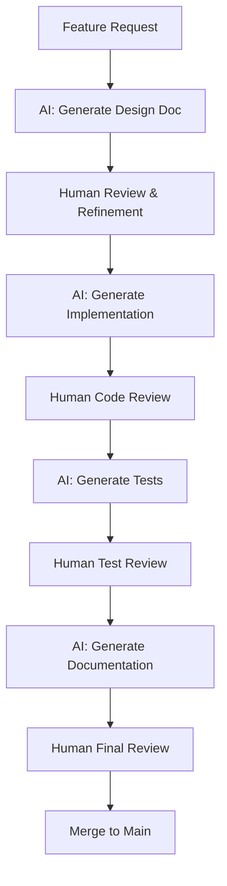

# AGENTS.md - GPT-Codex AI Agent Configuration

## Overview

This document defines the AI agent configurations, workflows, and best practices used in the GPT-Codex project for AI-assisted development. GPT-Codex leverages multiple AI agents (Claude, GPT-4, and specialized coding assistants) to enhance development velocity, code quality, and system reliability.

## Philosophy: AI-Augmented Development

GPT-Codex embraces AI as a collaborative development partner rather than a replacement for human expertise. The goal is to:

- **Accelerate Development**: Leverage AI for rapid prototyping, boilerplate generation, and iterative refinement
- **Enhance Quality**: Use AI for code review, test generation, and documentation
- **Maintain Control**: Keep humans in the decision-making loop for architecture and critical logic
- **Preserve Transparency**: Document AI contributions and maintain clear attribution

## AI Agent Roles

### Primary Development Agents

#### 1. **Claude (Anthropic)** - Architecture & Documentation Specialist
- **Primary Use Cases**:
  - System architecture design and review
  - Comprehensive documentation generation
  - Complex code refactoring and optimization
  - Security analysis and vulnerability assessment
  - Test suite design and implementation
- **Strengths**: Long context window, strong reasoning, excellent documentation quality
- **Integration Points**: Direct API access, VS Code extensions, CLI tools

#### 2. **GPT-4 / GPT Codex (OpenAI)** - Code Generation & Debugging
- **Primary Use Cases**:
  - Rapid code generation and prototyping
  - Debugging assistance and error resolution
  - API integration and library usage
  - Script automation and tooling
  - Pattern recognition in codebases
- **Strengths**: Fast iteration, broad language support, strong debugging capabilities
- **Integration Points**: GitHub Copilot, OpenAI API, VS Code extensions

#### 3. **GitHub Copilot** - Real-time Code Assistance
- **Primary Use Cases**:
  - Inline code completion
  - Function and class generation
  - Comment-to-code translation
  - Boilerplate reduction
- **Strengths**: IDE integration, context-aware suggestions, real-time feedback
- **Integration Points**: Native IDE plugins (VS Code, JetBrains, Neovim)

### Specialized Agents

#### 4. **Shell Script Assistant** - Automation & DevOps
- **Primary Use Cases**:
  - CI/CD pipeline scripts
  - Build automation
  - System administration tasks
  - Container orchestration scripts
- **Model**: Claude or GPT-4 with shell scripting focus
- **Quality Gates**: ShellCheck validation, Bats testing

#### 5. **Documentation Agent** - Technical Writing
- **Primary Use Cases**:
  - README generation and maintenance
  - API documentation
  - User guides and tutorials
  - Architecture decision records (ADRs)
- **Model**: Claude (preferred for long-form content)
- **Output Formats**: Markdown, reStructuredText, AsciiDoc

#### 6. **Test Generation Agent** - Quality Assurance
- **Primary Use Cases**:
  - Unit test generation
  - Integration test scaffolding
  - Test data creation
  - Edge case identification
- **Model**: GPT-4 or Claude
- **Frameworks**: Bats, pytest, Jest, Go testing

## AI-Assisted Workflows

### 1. Feature Development Workflow



**Process**:
1. Human provides feature requirements
2. AI agent generates design document with Claude
3. Human reviews and refines architecture
4. AI generates initial implementation with GPT-4/Copilot
5. Human reviews code for correctness and security
6. AI generates comprehensive test suite
7. Human validates test coverage and edge cases
8. AI generates user-facing documentation
9. Human performs final review and approval

### 2. Bug Fix Workflow

```bash
# Step 1: AI analyzes error logs and stack traces
$ ai-debug analyze --logs error.log --context src/

# Step 2: AI suggests root cause and fixes
$ ai-debug suggest --issue "authentication failure"

# Step 3: Human reviews and selects approach

# Step 4: AI generates fix with tests
$ ai-debug fix --apply --test

# Step 5: Human validates fix in development environment
```

### 3. Refactoring Workflow

```bash
# Step 1: AI analyzes codebase for improvements
$ ai-refactor analyze --target src/legacy/ --metrics complexity,duplication

# Step 2: AI generates refactoring plan
$ ai-refactor plan --priority high

# Step 3: Human approves plan

# Step 4: AI performs incremental refactoring
$ ai-refactor apply --incremental --with-tests

# Step 5: Human reviews each increment before proceeding
```

### 4. Documentation Workflow

```bash
# Step 1: AI scans codebase for undocumented areas
$ ai-docs scan --missing --outdated

# Step 2: AI generates documentation drafts
$ ai-docs generate --format markdown --target docs/

# Step 3: Human reviews and enhances with domain expertise

# Step 4: AI updates README and cross-references
$ ai-docs update-readme --auto-link
```

## AI Integration Points

### Development Environment

#### VS Code Configuration
```json
{
  "github.copilot.enable": {
    "*": true,
    "yaml": true,
    "markdown": true,
    "shellscript": true
  },
  "claude.apiKey": "${CLAUDE_API_KEY}",
  "claude.model": "claude-sonnet-4-20250514",
  "openai.apiKey": "${OPENAI_API_KEY}"
}
```

#### CLI Tools
```bash
# Install AI development assistants
pip install anthropic openai
npm install -g @anthropic-ai/sdk

# Configure environment
export CLAUDE_API_KEY="your-key-here"
export OPENAI_API_KEY="your-key-here"
```

### CI/CD Integration

#### GitHub Actions AI Workflows

```yaml
# .github/workflows/ai-review.yml
name: AI Code Review
on: [pull_request]

jobs:
  ai-review:
    runs-on: ubuntu-latest
    steps:
      - uses: actions/checkout@v4
      
      - name: AI Security Scan
        uses: anthropic/claude-action@v1
        with:
          model: claude-sonnet-4
          task: security-review
          files: "**/*.{py,js,sh,go}"
          
      - name: AI Code Quality Check
        run: |
          ai-review --model gpt-4 --standards pep8,shellcheck
          
      - name: Post Review Comment
        uses: actions/github-script@v7
        with:
          script: |
            github.rest.issues.createComment({
              issue_number: context.issue.number,
              owner: context.repo.owner,
              repo: context.repo.repo,
              body: process.env.AI_REVIEW_OUTPUT
            })
```

### API Usage Patterns

#### Claude API Example
```python
import anthropic

client = anthropic.Anthropic(api_key=os.environ.get("CLAUDE_API_KEY"))

def generate_tests(source_code: str, language: str) -> str:
    """Generate comprehensive test suite using Claude."""
    message = client.messages.create(
        model="claude-sonnet-4-20250514",
        max_tokens=4096,
        messages=[{
            "role": "user",
            "content": f"""Generate a comprehensive test suite for this {language} code:

```{language}
{source_code}
```

Include:
- Unit tests for all functions
- Edge case coverage
- Error handling tests
- Integration test stubs
"""
        }]
    )
    return message.content[0].text
```

#### OpenAI API Example
```python
import openai

def debug_error(error_message: str, code_context: str) -> str:
    """Use GPT-4 to analyze and suggest fixes for errors."""
    response = openai.ChatCompletion.create(
        model="gpt-4",
        messages=[
            {"role": "system", "content": "You are an expert debugger."},
            {"role": "user", "content": f"""
Error: {error_message}

Code Context:
{code_context}

Provide:
1. Root cause analysis
2. Suggested fix with code
3. Prevention strategies
"""}
        ]
    )
    return response.choices[0].message.content
```

## Quality Gates & Validation

### AI-Generated Code Standards

All AI-generated code must pass:

1. **Linting**: Language-specific linters (pylint, eslint, shellcheck)
2. **Testing**: Minimum 80% test coverage
3. **Security**: Vulnerability scanning with Trivy/Semgrep
4. **Human Review**: Mandatory code review by maintainer
5. **Documentation**: Inline comments and user documentation

### Review Checklist for AI Contributions

- [ ] Code follows project style guidelines
- [ ] No hardcoded secrets or credentials
- [ ] Error handling is comprehensive
- [ ] Tests cover happy path and edge cases
- [ ] Documentation is clear and accurate
- [ ] No obvious security vulnerabilities
- [ ] Performance considerations addressed
- [ ] Dependencies are justified and minimal

## Best Practices

### Prompting Guidelines

#### Effective Prompts
```
✅ GOOD: "Generate a bash function that validates YAML files using yq, 
includes error handling, and returns exit code 0 on success. Add inline 
comments explaining each step."

❌ BAD: "Make a YAML validator"
```

#### Context Provision
```bash
# Provide relevant context for better results
$ cat src/config.py | ai-assist refactor --context "
This config loader needs to:
- Support environment variable overrides
- Validate required fields
- Handle missing files gracefully
- Use type hints
"
```

#### Iterative Refinement
```
1st prompt: "Create a Containerfile for a Python FastAPI app"
2nd prompt: "Add multi-stage build to reduce image size"
3rd prompt: "Include security scanning and non-root user"
4th prompt: "Optimize layer caching for faster rebuilds"
```

### Attribution & Transparency

#### Code Comments
```python
# AI-generated with Claude Sonnet 4 (2025-01-15)
# Prompt: "Create async function to fetch and parse remote YAML configs"
# Human modifications: Added retry logic and custom timeout handling
async def fetch_remote_config(url: str, timeout: int = 10) -> dict:
    """Fetch and parse YAML configuration from remote URL."""
    # ... implementation
```

#### Commit Messages
```bash
git commit -m "feat: Add remote config loader

AI-assisted implementation using Claude for initial structure
and error handling patterns. Human review added retry logic
and custom timeout handling.

Co-authored-by: Claude <ai@anthropic.com>"
```

#### Documentation
```markdown
## AI Development Notes

This module was developed with AI assistance:
- Initial architecture: Claude Sonnet 4
- Implementation: GitHub Copilot + GPT-4
- Test generation: Claude Sonnet 4
- Documentation: Claude Sonnet 4

All AI-generated code was reviewed and modified by human maintainers.
```

## Security Considerations

### AI-Specific Security Risks

1. **Prompt Injection**: Never pass unsanitized user input directly to AI APIs
2. **Data Leakage**: Avoid sending sensitive data (credentials, PII) to AI services
3. **Code Vulnerabilities**: AI may generate insecure patterns (SQL injection, XSS)
4. **Dependency Risks**: AI might suggest outdated or vulnerable libraries

### Mitigation Strategies

```python
# Sanitize inputs before AI processing
def sanitize_for_ai(user_input: str) -> str:
    """Remove sensitive patterns before sending to AI."""
    # Remove potential secrets
    sanitized = re.sub(r'(api[_-]?key|token|password)\s*=\s*[\'\"][^\'\"]+[\'\"]', 
                       r'\1=REDACTED', user_input)
    # Remove internal URLs
    sanitized = re.sub(r'https?://internal\.[^\s]+', 'INTERNAL_URL', sanitized)
    return sanitized
```

## Troubleshooting AI Agents

### Common Issues

#### Issue: AI generates incorrect or insecure code
**Solution**: 
- Provide more specific context and constraints
- Use stricter system prompts
- Increase human review frequency
- Add automated security scanning

#### Issue: Inconsistent code style across AI generations
**Solution**:
- Define explicit style guide in prompts
- Use auto-formatters (black, prettier, gofmt)
- Create reusable prompt templates
- Maintain project style documentation

#### Issue: AI misunderstands project architecture
**Solution**:
- Provide architecture diagrams in prompts
- Include relevant code context
- Use project-specific glossary
- Maintain up-to-date technical documentation

## Metrics & Evaluation

### AI Contribution Metrics

Track AI effectiveness with:
- Lines of code generated vs. retained
- Test coverage of AI-generated code
- Bug rate in AI vs. human code
- Time saved on routine tasks
- Developer satisfaction surveys

### Quality Metrics

```bash
# Generate AI contribution report
$ ai-metrics report --since 2025-01-01

AI Contributions Summary:
- Total commits with AI assistance: 127
- Lines of code generated: 15,430
- Lines retained after review: 12,890 (83.5%)
- Test coverage: 87.3%
- Security vulnerabilities: 0 critical, 2 medium (patched)
- Time saved estimate: 156 hours
```

## Future Enhancements

### Planned AI Capabilities

- [ ] Automated dependency updates with compatibility testing
- [ ] AI-powered code review bot with project-specific rules
- [ ] Intelligent test case generation from requirements
- [ ] Automated documentation synchronization
- [ ] Predictive issue detection from commit patterns
- [ ] AI-assisted architecture decision records (ADRs)
- [ ] Automated security patch generation and testing

### Research Areas

- Fine-tuning models on project-specific codebases
- Local LLM deployment for sensitive codebases
- AI-powered pair programming workflows
- Automated regression detection
- Natural language to infrastructure-as-code translation

## Resources

### AI Development Tools

- **Claude API**: https://www.anthropic.com/api
- **OpenAI API**: https://platform.openai.com/
- **GitHub Copilot**: https://github.com/features/copilot
- **Cursor IDE**: https://cursor.sh/
- **Continue**: https://continue.dev/

### Prompt Libraries

- **Awesome ChatGPT Prompts**: https://github.com/f/awesome-chatgpt-prompts
- **LangChain Prompt Templates**: https://python.langchain.com/docs/modules/model_io/prompts/
- **Anthropic Prompt Library**: https://docs.anthropic.com/claude/prompt-library

### Learning Resources

- **OpenAI Cookbook**: https://github.com/openai/openai-cookbook
- **Anthropic Documentation**: https://docs.anthropic.com/
- **AI-Assisted Development Guide**: https://github.blog/developer-skills/github/how-to-use-github-copilot-for-explaining-code/

## Contributing to AI Workflows

We welcome contributions that improve our AI-assisted development practices:

1. Share effective prompts and patterns
2. Report AI-generated code quality issues
3. Suggest new AI integration points
4. Document AI limitations and workarounds
5. Contribute to prompt template library

## License

AI-generated contributions are subject to the same MIT License as the rest of the project. All AI-generated code becomes part of the project codebase with appropriate attribution.

## Acknowledgments

- **Claude** (Anthropic) - Architecture design, documentation, and complex reasoning
- **GPT-4** (OpenAI) - Code generation and debugging assistance
- **GitHub Copilot** - Real-time coding assistance and productivity enhancement
- The broader AI developer tools community for advancing AI-assisted development practices

---

**AI-Augmented Development**

*This AGENTS.md was generated with Claude Sonnet 4 and human oversight on 2025-12-01*

*For questions about AI workflows, open an issue or contact the maintainers*
