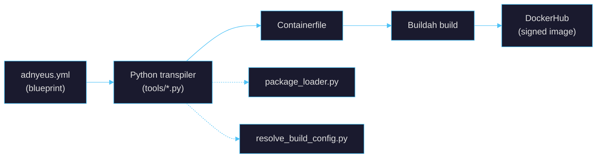
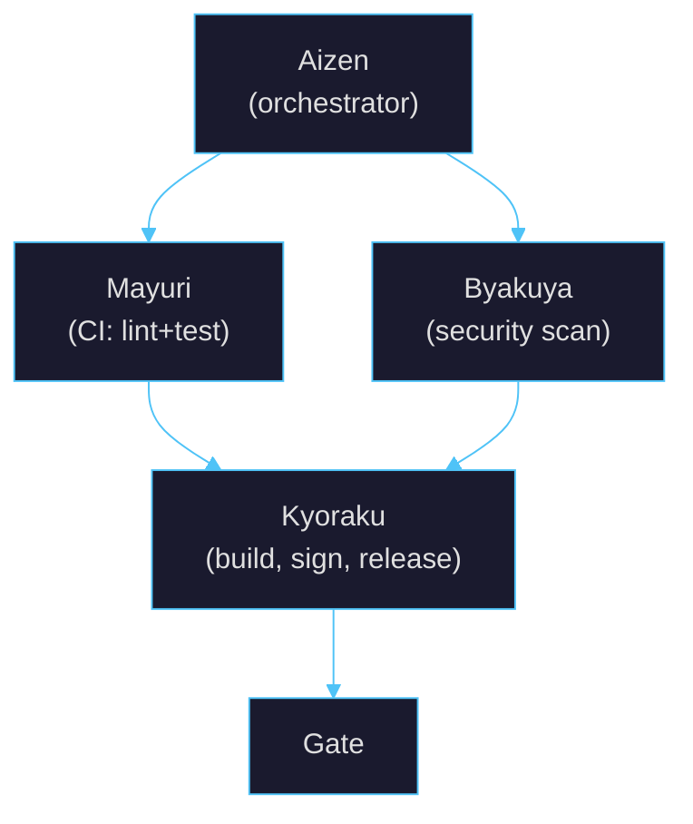

# Exousia

> *Can't Fear Your Own OS*

[](https://github.com/borninthedark/exousia/actions/workflows/aizen.yml)
[](https://github.com/borninthedark/exousia/actions/workflows/aizen.yml?query=branch%3Amain+is%3Asuccess)
[](https://codecov.io/gh/borninthedark/exousia)
[](#highly-experimental-disclaimer)


Declarative, container-based immutable operating systems built on
[**bootc**](https://github.com/bootc-dev/bootc). YAML blueprints define OS
images, Python tools transpile them to Containerfiles, Buildah builds them, and
GitHub Actions pushes signed images to DockerHub.

**Note:** The "Reiatsu" badge is inspired by *BLEACH* by **Tite Kubo** --
used as a playful status indicator with full acknowledgment.

## Table of Contents

- [Highly Experimental Disclaimer](#highly-experimental-disclaimer)
- [Quick Start](#quick-start)
- [Architecture](#architecture)
  - [Build Flow](#build-flow)
  - [The Shinigami Pipeline](#the-shinigami-pipeline)
  - [Versioning](#versioning)
- [Customizing Builds](#customizing-builds)
- [Local Build Pipeline](#local-build-pipeline)
- [YubiKey Authentication](#yubikey-authentication)
- [Required Secrets and Variables](#required-secrets-and-variables)
- [Documentation](#documentation)
- [Contributing](#contributing)
- [License](#license)
- [Acknowledgments](#acknowledgments)

## Highly Experimental Disclaimer

> **Warning**: This project is highly experimental. There are **no guarantees**
> about stability, data safety, or fitness for any purpose. Proceed only if you
> understand the risks.

## Quick Start

### Use a published image

```bash
sudo bootc switch docker.io/1borninthedark/exousia:latest
sudo bootc upgrade && sudo systemctl reboot
```

> Exousia delivers desktop apps via Flatpak. Set up Flathub before switching:
>
> ```bash
> flatpak remote-add --if-not-exists --system flathub https://dl.flathub.org/repo/flathub.flatpakrepo
> ```

### Build locally

```bash
git clone https://github.com/borninthedark/exousia.git && cd exousia
just build
```

### Trigger a remote build

```bash
curl -X POST \
  -H "Accept: application/vnd.github+json" \
  -H "Authorization: Bearer $GITHUB_TOKEN" \
  https://api.github.com/repos/borninthedark/exousia/actions/workflows/aizen.yml/dispatches \
  -d '{"ref":"main","inputs":{"image_type":"fedora-bootc","distro_version":"43","enable_plymouth":"true"}}'
```

Or use the manual **workflow_dispatch** in the [GitHub Actions UI](https://github.com/borninthedark/exousia/actions).

## Architecture

### Build Flow



| Component | Description |
|-----------|-------------|
| **Blueprint** (`adnyeus.yml`) | Declares base image, packages, overlays, scripts, services, and build flags |
| **Transpiler** (`tools/yaml-to-containerfile.py`) | Reads the blueprint, loads package lists from `overlays/base/packages/`, emits a valid Containerfile |
| **Overlays** | Static files, configs, and scripts under `overlays/base/` (shared) and `overlays/sway/` (desktop) |
| **Tests** | Bats tests in `custom-tests/` validate the built image |

### The Shinigami Pipeline

Every CI workflow is named after a captain from the Gotei 13. Each captain's
division maps to the workflow's role:



| Captain | Division | Role | Key Tools |
|---------|----------|------|-----------|
| **Aizen** | -- | Orchestrator | Calls Mayuri + Byakuya in parallel, then Kyoraku |
| **Mayuri** | 12th (R&D) | CI | Ruff, Black, isort, pytest, Codecov |
| **Byakuya** | 6th (Law) | Security | Hadolint, Checkov, Trivy config scan, Bandit |
| **Kyoraku** | Captain-Commander | Build & Release | Docker Buildx, Cosign (OIDC), Trivy image scan, semver |

### Versioning

Versions are automatic via [conventional commits](https://www.conventionalcommits.org/):
`feat:` bumps minor, `fix:` bumps patch, `feat!:` bumps major.

## Customizing Builds

### Packages

| Scope | Location |
|-------|----------|
| Base packages | `overlays/base/packages/common/*.yml` |
| Window managers | `overlays/base/packages/window-managers/*.yml` |
| Removals | `overlays/base/packages/common/remove.yml` |

All packages are managed through the package loader. Edit the YAML lists, not
the blueprint directly.

### Configuration

| Directory | Purpose |
|-----------|---------|
| `overlays/sway/configs/sway/` | Sway WM and config.d snippets |
| `overlays/sway/configs/greetd/` | greetd display manager |
| `overlays/sway/configs/plymouth/` | Boot splash themes |
| `overlays/base/configs/pam.d/` | PAM authentication (YubiKey U2F) |
| `overlays/sway/scripts/runtime/` | Runtime scripts (autotiling, lid, volume) |
| `overlays/sway/scripts/setup/` | Build-time setup scripts |

### Desktop and boot

- **Sway** uses `sway-config-minimal` with layered config.d overrides.
  Configuration references drawn from [openSUSEway](https://github.com/openSUSE/openSUSEway).
- **Plymouth** is toggled via `enable_plymouth: true` in the blueprint.
- **greetd** is the login manager for all image types.
- **ZFS** is optional -- enable via `build.enable_zfs: true`. See [ZFS docs](docs/zfs-bootc.md).

## Local Build Pipeline

Build images locally with Podman Quadlet services before promoting to DockerHub:

```bash
just quadlet-install && just quadlet-start   # start Forgejo + local registry
just local-build                             # generate containerfile, buildah build, push to local registry
just local-test                              # run bats tests against local image
just local-push                              # promote to DockerHub via skopeo
```

See [Local Build Pipeline docs](docs/local-build-pipeline.md) for the full
setup, Forgejo runner registration, and troubleshooting.

---

## YubiKey Authentication

Exousia ships PAM U2F modules for YubiKey hardware authentication. After
deploying, register your key:

```bash
mkdir -p ~/.config/Yubico
pamu2fcfg > ~/.config/Yubico/u2f_keys       # primary key
pamu2fcfg -n >> ~/.config/Yubico/u2f_keys    # backup key (recommended)
```

`sudo` accepts YubiKey as an alternative to password by default. See
[Fedora YubiKey Quick Docs](https://docs.fedoraproject.org/en-US/quick-docs/using-yubikeys/).

## Required Secrets and Variables

Configure in GitHub **Settings > Secrets and variables > Actions**.

**Secrets:**

| Name | Purpose |
|------|---------|
| `DOCKERHUB_TOKEN` | DockerHub access token |

**Variables:**

| Name | Purpose | Required |
|------|---------|----------|
| `DOCKERHUB_USERNAME` | DockerHub username | Yes |
| `REGISTRY_URL` | Registry URL (defaults to `docker.io`) | No |

Secrets propagate to child workflows via `secrets: inherit` in Aizen.

## Documentation

**[Full Documentation Index](docs/README.md)**

| Topic | Links |
|-------|-------|
| Getting Started | [Upgrade Guide](docs/bootc-upgrade.md) &#124; [Image Builder](docs/bootc-image-builder.md) |
| Architecture | [Overlay System](docs/overlay-system.md) &#124; [Local Build Pipeline](docs/local-build-pipeline.md) |
| Desktop | [Sway + greetd](docs/sway-session-greetd.md) &#124; [Plymouth](docs/reference/plymouth-usage.md) |
| Testing | [Test Suite](docs/testing/README.md) &#124; [Writing Tests](docs/reference/writing-tests.md) |
| Reference | [Troubleshooting](docs/reference/troubleshooting.md) &#124; [Security](SECURITY.md) |

## Contributing

Contributions welcome. Submit PRs or open issues. Use
[conventional commits](https://www.conventionalcommits.org/) for automatic
versioning.

## License

MIT License -- see LICENSE file.

## Acknowledgments

- [bootc project](https://github.com/bootc-dev/bootc) maintainers and the Fedora community
- [Fedora Sway SIG](https://gitlab.com/fedora/sigs/sway/sway-config-fedora) for Sway configs and QoL improvements
- [openSUSEway](https://github.com/openSUSE/openSUSEway) for Sway enhancements and config references
- [Universal Blue](https://universal-blue.org/) and [BlueBuild](https://blue-build.org/) for container-native workflows
- [Buildah](https://buildah.io/), [Podman](https://podman.io/), [Skopeo](https://github.com/containers/skopeo)

### AI-Assisted Development

This project uses AI-assisted development tools:

- **[Claude Code](https://claude.ai/claude-code)** (Anthropic)
- **[ChatGPT Codex](https://openai.com/index/openai-codex/)** (OpenAI)
- **[GitHub Dependabot](https://docs.github.com/en/code-security/dependabot)**
- **[github-actions[bot]](https://github.com/apps/github-actions)** -- automated releases and tagging

### Creative

**Tite Kubo** -- Creator of *BLEACH*. The CI/CD naming scheme (Shinigami Pipeline)
and Reiatsu status indicator are inspired by the Gotei 13 and themes from BLEACH,
used respectfully as a playful aesthetic. All rights belong to Tite Kubo and
respective copyright holders.

---

**Built with [bootc](https://github.com/bootc-dev/bootc)** | [Docs](https://bootc-dev.github.io/bootc/) | [Fedora bootc](https://docs.fedoraproject.org/en-US/bootc/) | MIT License
