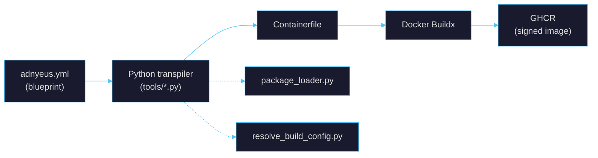
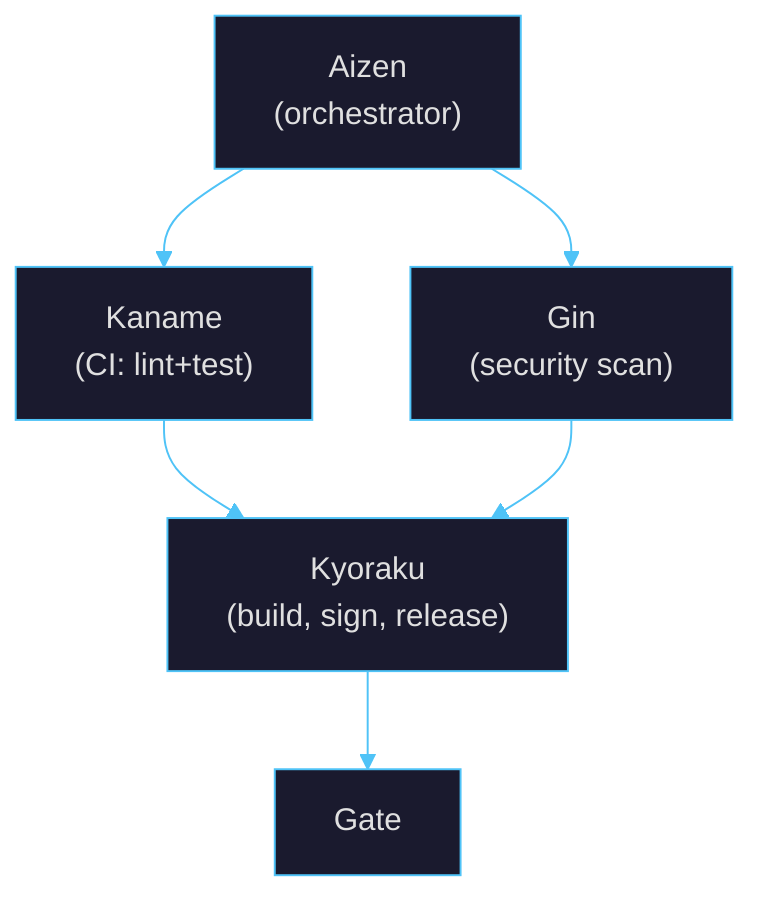

# Exousia

[](#cicd-pipeline)
[](https://github.com/pre-commit/pre-commit)

Declarative bootc image builder for Fedora Linux. YAML blueprints define OS
images, Python tools transpile them to Containerfiles, Docker Buildx builds them,
and GitHub Actions pushes signed images to GHCR.

> **Warning** -- This project is highly experimental. There are no guarantees
> about stability, data safety, or fitness for any purpose.

---

## Contents

- [Quick Start](#quick-start)
- [How It Works](#how-it-works)
- [CI/CD Pipeline](#cicd-pipeline)
- [Customizing Builds](#customizing-builds)
- [Official Dotfiles](#official-dotfiles)
- [YubiKey Authentication](#yubikey-authentication)
- [Required Secrets and Variables](#required-secrets-and-variables)
- [Documentation](#documentation)
- [Contributing](#contributing)
- [Acknowledgments](#acknowledgments)

---

## Quick Start

### Use a published image

```bash
make local-mirror
sudo bootc switch localhost:5000/exousia:latest
sudo bootc upgrade && sudo systemctl reboot
```

> Exousia delivers desktop apps via Flatpak. Set up Flathub before switching:
>
> ```bash
> flatpak remote-add --if-not-exists --system flathub https://dl.flathub.org/repo/flathub.flatpakrepo
> ```

### Build locally

```bash
git clone https://github.com/borninthedark/exousia.git && cd exousia
make build
```

---

## How It Works


```mermaid
%%{init: {'theme': 'base', 'themeVariables': {'primaryColor': '#1a1a2e', 'primaryTextColor': '#e0e0e0', 'primaryBorderColor': '#4fc3f7', 'lineColor': '#4fc3f7', 'secondaryColor': '#16213e', 'tertiaryColor': '#0f3460', 'edgeLabelBackground': '#1a1a2e'}}}%%
graph LR
    A["adnyeus.yml<br/>(blueprint)"] --> B["Python transpiler<br/>(tools/*.py)"]
    B --> C["Containerfile"]
    C --> D["Docker Buildx"]
    D --> E["GHCR<br/>(signed image)"]
    B -.-> F["package_loader.py"]
    B -.-> G["resolve_build_config.py"]
```

- **Blueprint** (`adnyeus.yml`) -- declares base image, packages, overlays,
  scripts, services, and build flags.
- **Transpiler** (`tools/yaml-to-containerfile.py`) -- reads the blueprint,
  loads package lists from `overlays/base/packages/`, and emits a valid
  Containerfile.
- **Overlays** -- static files, configs, and scripts organized under
  `overlays/base/` (shared) and `overlays/sway/` (desktop-specific).
- **Tests** -- Bats tests in `custom-tests/` validate the built image.

---

## CI/CD Pipeline

Every workflow is named after a captain from the Gotei 13. Each captain's
division maps to the workflow's role in the pipeline:


```mermaid
%%{init: {'theme': 'base', 'themeVariables': {'primaryColor': '#1a1a2e', 'primaryTextColor': '#e0e0e0', 'primaryBorderColor': '#4fc3f7', 'lineColor': '#4fc3f7', 'secondaryColor': '#16213e', 'tertiaryColor': '#0f3460', 'edgeLabelBackground': '#1a1a2e'}}}%%
graph TD
    A["Aizen<br/>(orchestrator)"] --> B["Kaname<br/>(CI: lint+test)"]
    A --> C["Gin<br/>(security scan)"]
    B --> D["Kyoraku<br/>(build, sign, release)"]
    C --> D
    D --> E["Gate"]
```

Aizen calls Kaname and Gin in parallel. When both pass, Kyoraku builds,
signs, scans, and cuts a semver release on `main`.

---

## Customizing Builds

### Packages

| Scope | Location |
|-------|----------|
| Base packages | `overlays/base/packages/common/*.yml` |
| Window managers | `overlays/base/packages/window-managers/*.yml` |
| Removals | `overlays/base/packages/common/remove.yml` |

All packages are managed through the package loader. Edit the YAML lists, not
the blueprint directly.

### Configuration

| Directory | Purpose |
|-----------|---------|
| `overlays/sway/configs/sway/` | Sway WM and config.d snippets |
| `overlays/sway/configs/greetd/` | greetd display manager |
| `overlays/sway/configs/plymouth/` | Boot splash themes |
| `overlays/base/configs/pam.d/` | PAM authentication (YubiKey U2F) |
| `overlays/sway/scripts/runtime/` | Runtime scripts (autotiling, lid, volume) |
| `overlays/sway/scripts/setup/` | Build-time setup scripts |

### Desktop and boot

- **Sway** uses `sway-config-minimal` with layered config.d overrides.
  Configuration references drawn from [openSUSEway](https://github.com/openSUSE/openSUSEway).
- **Plymouth** is toggled via `enable_plymouth: true` in the blueprint.
- **greetd** is the login manager for all image types.

---

## Official Dotfiles

This project is designed to be used with the official **[borninthedark/dotfiles](https://github.com/borninthedark/dotfiles)** repository.

The image uses the `chezmoi` module to automatically initialize these dotfiles
on first login for all users, providing a consistent development environment
"out of the box".

---

## YubiKey Authentication

Exousia ships PAM U2F modules for YubiKey hardware authentication. After
deploying, register your key:

```bash
mkdir -p ~/.config/Yubico
pamu2fcfg > ~/.config/Yubico/u2f_keys       # primary key
pamu2fcfg -n >> ~/.config/Yubico/u2f_keys    # backup key (recommended)
```

`sudo` accepts YubiKey as an alternative to password by default. See
[Fedora YubiKey Quick Docs](https://docs.fedoraproject.org/en-US/quick-docs/using-yubikeys/).

---

## Required Secrets and Variables

Configure in GitHub **Settings > Secrets and variables > Actions**.

**Secrets:**

| Name | Purpose |
|------|---------|
| `GHCR_PAT` | GHCR personal access token for CI RPM override pulls and local/manual registry access |

**Variables:**

| Name | Purpose | Required |
|------|---------|----------|
| `REGISTRY_URL` | Registry URL (defaults to `ghcr.io`) | No |

Secrets propagate to child workflows via `secrets: inherit` in Aizen.

---

## Documentation

**[Full Documentation Index](docs/README.md)**

| Topic | Links |
|-------|-------|
| Getting Started | [Upgrade Guide](docs/bootc-upgrade.md) &#124; [Image Builder](docs/bootc-image-builder.md) |
| Desktop | [Sway + greetd](docs/sway-session-greetd.md) &#124; [Plymouth](docs/reference/plymouth-usage.md) |
| Testing | [Test Suite](docs/testing/README.md) &#124; [Writing Tests](docs/reference/writing-tests.md) |
| Reference | [Troubleshooting](docs/reference/troubleshooting.md) &#124; [Security](SECURITY.md) |

---

## Contributing

Contributions welcome. Submit PRs or open issues. Use
[conventional commits](https://www.conventionalcommits.org/) for automatic
versioning.

---

## Acknowledgments

- [bootc project](https://github.com/bootc-dev/bootc) maintainers and the Fedora community
- [Fedora Sway SIG](https://gitlab.com/fedora/sigs/sway/sway-config-fedora) for Sway configs and QoL improvements
- [openSUSEway](https://github.com/openSUSE/openSUSEway) for Sway enhancements and config references
- [Universal Blue](https://universal-blue.org/) and [BlueBuild](https://blue-build.org/) for container-native workflows
- [Buildah](https://buildah.io/), [Podman](https://podman.io/), [Skopeo](https://github.com/containers/skopeo), [Docker](https://www.docker.com/)
- [Maple Mono](https://github.com/subframe7536/maple-font) by subframe7536 for the terminal and UI font
- [Kripton GTK Theme](https://github.com/EliverLara/Kripton) by EliverLara for the desktop color scheme
- [Cyberpunk Technotronic](https://github.com/dreifacherspass/cyberpunk-technotronic-icon-theme) by dreifacherspass for the icon theme
- [Bibata Cursor](https://github.com/ful1e5/Bibata_Cursor) by ful1e5 for the cursor theme

### AI-Assisted Development

This project uses AI-assisted development tools:

- **[Claude Code](https://claude.ai/claude-code)** (Anthropic)
- **[Gemini CLI](https://github.com/google-gemini/gemini-cli)** (Google)
- **[ChatGPT Codex](https://openai.com/index/openai-codex/)** (OpenAI)
- **[GitHub Dependabot](https://docs.github.com/en/code-security/dependabot)**
- **[github-actions[bot]](https://github.com/apps/github-actions)** -- automated releases and tagging

### Creative

**Tite Kubo** -- Creator of *BLEACH*. The CI/CD naming scheme (Shinigami Pipeline)
and Reiatsu status indicator are inspired by the Gotei 13 and themes from BLEACH,
used respectfully as a playful aesthetic. All rights belong to Tite Kubo and
respective copyright holders.

---

**Built with [bootc](https://github.com/bootc-dev/bootc)** | [Docs](https://bootc-dev.github.io/bootc/) | [Fedora bootc](https://docs.fedoraproject.org/en-US/bootc/) | MIT License
