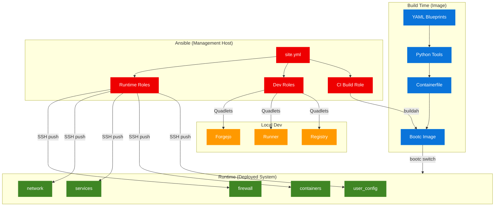

# Ansible Dynamic Reconfiguration

Ansible playbooks for runtime management of deployed bootc systems and local development.

## Architecture



## Design Principles

Following [Fedora bootc best practices](https://docs.fedoraproject.org/en-US/bootc/):

- **All changes are transient**: Uses `/run` and `/tmp`, never persists to `/etc`
- **Push model**: Ansible pushes over SSH to deployed bootc systems
- **Complementary to image**: Image defines base state, Ansible applies runtime deltas
- **Injected code goes to /tmp**: Following bootc recommendation for dynamic code
- Ansible is NOT baked into the image (runs from management host)

## Directory Structure

```text
ansible/
├── inventory/
│   ├── hosts.yml              # Host inventory
│   └── group_vars/
│       └── all.yml            # Shared variables
├── site.yml                   # Main entry point
├── ansible.cfg                # Configuration
└── roles/
    ├── firewall/              # Transient firewall rules
    ├── network/               # Transient NetworkManager config
    ├── containers/            # Podman container management
    ├── services/              # systemd runtime overrides
    ├── user_config/           # User config via /tmp
    ├── quadlets/              # Local dev Quadlet deployment
    └── ci_build/              # CI build pipeline orchestration
```

## Roles

### Runtime Roles (tag: `runtime`)

These operate on deployed bootc systems via SSH. All changes are lost on reboot.

| Role | Purpose | Mechanism |
|------|---------|-----------|
| `firewall` | Open ports transiently | `firewall-cmd` without `--permanent` |
| `network` | DNS, NM config | `/run/NetworkManager/conf.d/`, `nmcli --temporary` |
| `containers` | Pull images, auto-update | `podman pull`, `podman auto-update` |
| `services` | Unit overrides | `systemctl edit --runtime` |
| `user_config` | Ad-hoc scripts | Deploy to `/tmp`, execute, clean up |

### Development Roles (tag: `quadlets`)

Deploys Podman Quadlet services for local development:

| Service | Port | Purpose |
|---------|------|---------|
| Forgejo | 3000 (HTTP), 2222 (SSH) | Self-hosted git forge |
| Forgejo Runner | -- | CI runner for Forgejo Actions |
| Registry | 5000 | Local container registry |

All services use the `exousia.network` (10.89.1.0/24) for inter-service communication.
See [Local Build Pipeline](local-build-pipeline.md) for Quadlet setup, build
workflow, and promotion to DockerHub.

### CI Build Role (tag: `ci_build`)

Orchestrates the full build pipeline, mirroring GitHub Actions CI:

1. Sync dependencies with `uv`
2. Resolve build configuration
3. Generate Containerfile from YAML
4. Run Python tests
5. Build image with buildah
6. Push to registry (optional)
7. Run Bats integration tests (optional)

## Usage

### Runtime Reconfiguration

```bash
# Configure deployed bootc systems
ansible-playbook ansible/site.yml --tags runtime

# Dry run
ansible-playbook ansible/site.yml --tags runtime --check

# Specific host
ansible-playbook ansible/site.yml --tags runtime --limit bootc-host-01
```

### Local Development Setup

```bash
# Deploy Quadlet services
ansible-playbook ansible/site.yml --tags quadlets

# With runner registration token
ansible-playbook ansible/site.yml --tags quadlets \
  --extra-vars "forgejo_runner_token=YOUR_TOKEN"
```

### CI Build

```bash
# Local build (no push)
ansible-playbook ansible/site.yml --tags ci_build

# Build and push to DockerHub
ansible-playbook ansible/site.yml --tags ci_build \
  --extra-vars "ci_build_push=true ci_build_tag=my-tag"

# Build with Bats tests
ansible-playbook ansible/site.yml --tags ci_build \
  --extra-vars "ci_build_run_bats=true"

# Build specific image type
ansible-playbook ansible/site.yml --tags ci_build \
  --extra-vars "ci_build_image_type=fedora-bootc ci_build_distro_version=44"
```

### Using just

```bash
just ansible-lint            # Lint playbooks
just ansible-run             # Dry run (--check)
just ansible-apply           # Apply changes
```

## Variables Reference

### Runtime Variables

| Variable | Default | Description |
|----------|---------|-------------|
| `firewall_open_ports` | `[22, 80, 443]` | Ports to open transiently |
| `network_dns_servers` | `[1.1.1.1, 9.9.9.9]` | DNS servers |
| `services_runtime_overrides` | `[]` | systemd unit override list |
| `user_config_scripts` | `[]` | Scripts to deploy to /tmp |

### Quadlet Variables

| Variable | Default | Description |
|----------|---------|-------------|
| `quadlet_source_dir` | `../overlays/deploy` | Path to Quadlet files |
| `forgejo_runner_token` | (unset) | Runner registration token |

### CI Build Variables

| Variable | Default | Description |
|----------|---------|-------------|
| `ci_build_yaml_config` | `adnyeus.yml` | YAML blueprint to build |
| `ci_build_image_type` | `fedora-sway-atomic` | Image type |
| `ci_build_distro_version` | `43` | Fedora version |
| `ci_build_enable_plymouth` | `true` | Plymouth boot splash |
| `ci_build_registry` | `docker.io` | Target registry |
| `ci_build_image` | `1borninthedark/exousia` | Image path |
| `ci_build_tag` | `latest` | Image tag |
| `ci_build_push` | `false` | Push after build |
| `ci_build_run_bats` | `false` | Run Bats tests |
