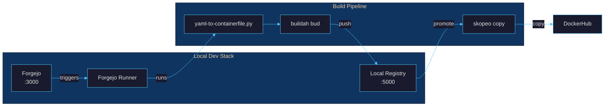

# Local Build Pipeline

Build, test, and promote container images using local Podman Quadlet services.

## Architecture



## Quadlet Files

All Quadlet definitions live in `overlays/deploy/`:

| File | Type | Purpose |
|------|------|---------|
| `forgejo.container` | Container | Self-hosted git forge (ports 3000, 2222) |
| `forgejo-runner.container` | Container | Forgejo Actions CI runner |
| `exousia-registry.container` | Container | Local container registry (port 5000) |
| `forgejo-data.volume` | Volume | Persistent Forgejo data |
| `forgejo-runner-data.volume` | Volume | Persistent runner data |
| `exousia-registry-data.volume` | Volume | Persistent registry storage |
| `exousia.network` | Network | Shared network (10.89.1.0/24) |

## Prerequisites

These tools are already included in the bootc image:

- **podman** -- container runtime and Quadlet host
- **buildah** -- OCI image builder
- **skopeo** -- image copy between registries
- **bats** -- integration test runner

## Setup

### Install and start Quadlet services

```bash
make quadlet-install
make quadlet-start
```

This copies all `.container`, `.volume`, and `.network` files to
`~/.config/containers/systemd/`, reloads systemd, and starts Forgejo and the
local registry.

### Verify services are running

```bash
make quadlet-status

# Registry health check
curl -s localhost:5000/v2/

# Forgejo UI
curl -s -o /dev/null -w "%{http_code}" localhost:3000
```

### Forgejo first-run setup

1. Open `http://localhost:3000` in a browser
2. Complete the initial configuration wizard
3. Create an admin account
4. Optionally mirror the GitHub repo:
   **Settings > Repository > Mirrors > Add Mirror**

### Register the Forgejo runner

1. In Forgejo, go to **Site Administration > Runners**
2. Copy the registration token
3. Set the token in the runner Quadlet:

```bash
systemctl --user stop forgejo-runner
# Edit ~/.config/containers/systemd/forgejo-runner.container
# Set: Environment=FORGEJO_RUNNER_TOKEN=<your-token>
systemctl --user daemon-reload
systemctl --user start forgejo-runner
```

## Build Workflow

### Build and push to local registry

```bash
make local-build              # tags as localhost:5000/exousia:latest
make local-build TAG=v1.2.3   # tags as localhost:5000/exousia:v1.2.3
```

This runs the full pipeline:

1. Generates a Containerfile from `adnyeus.yml`
2. Builds the image with `buildah`
3. Pushes to the local registry with `skopeo`

### Test the local image

```bash
make local-test               # runs bats tests against latest
make local-test TAG=v1.2.3    # runs bats tests against specific tag
```

### Promote to DockerHub

```bash
make local-push               # copies latest to docker.io/1borninthedark/exousia:latest
make local-push TAG=v1.2.3    # copies specific tag
```

### Verify

```bash
# List images in local registry
curl -s localhost:5000/v2/_catalog

# List tags for a specific image
skopeo list-tags docker://localhost:5000/exousia --tls-verify=false
```

## Service Management

```bash
make quadlet-start             # Start Forgejo + registry
make quadlet-stop              # Stop all services
make quadlet-status            # Show service status
make quadlet-logs              # Follow logs (all services)
```

## Troubleshooting

### Registry connection refused

The registry listens on port 5000. Check it is running:

```bash
systemctl --user status exousia-registry
journalctl --user -u exousia-registry --no-pager -n 20
```

### Forgejo runner not connecting

The runner requires Forgejo to be healthy first (`Requires=forgejo.service`).
Verify:

```bash
systemctl --user status forgejo
systemctl --user status forgejo-runner
```

If the runner shows `inactive`, ensure `FORGEJO_RUNNER_TOKEN` is set in the
Quadlet file and reload:

```bash
systemctl --user daemon-reload
systemctl --user restart forgejo-runner
```

### Port conflicts

Default ports: Forgejo 3000/2222, Registry 5000. Check for conflicts:

```bash
ss -tlnp | grep -E '3000|2222|5000'
```

### Buildah permission errors

Rootless buildah requires `/etc/subuid` and `/etc/subgid` entries. Verify:

```bash
grep $(whoami) /etc/subuid
grep $(whoami) /etc/subgid
```

### Skopeo TLS errors

The local registry uses HTTP (no TLS). Skopeo commands include
`--tls-verify=false` / `--dest-tls-verify=false` / `--src-tls-verify=false`
for local registry operations.

---

**[Back to Documentation Index](README.md)** | **[Back to Main README](../README.md)**
