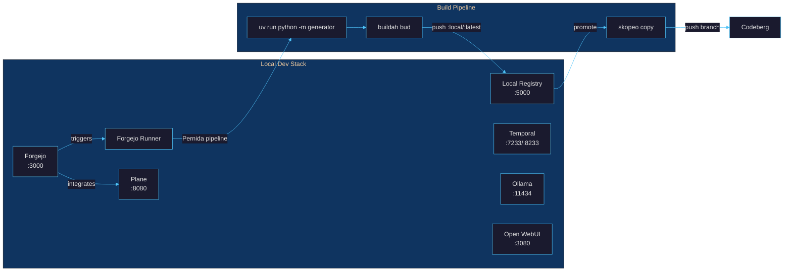

# Local Build Pipeline

Build, test, and promote container images using local Podman Quadlet services.
The default local workflow only starts the registry. Forgejo and Plane are
available, but opt-in.

## Architecture


```mermaid
%%{init: {'theme': 'base', 'themeVariables': {'primaryColor': '#1a1a2e', 'primaryTextColor': '#e0e0e0', 'primaryBorderColor': '#4fc3f7', 'lineColor': '#4fc3f7', 'secondaryColor': '#16213e', 'tertiaryColor': '#0f3460', 'edgeLabelBackground': '#1a1a2e'}}}%%
graph LR
    subgraph LOCAL["Local Dev Stack"]
        FG["Forgejo<br/>:3000"]
        RN["Forgejo Runner"]
        REG["Local Registry<br/>:5000"]
        PL["Plane<br/>:8080"]
        TMP["Temporal<br/>:7233/:8233"]
        OLL["Ollama<br/>:11434"]
        OWU["Open WebUI<br/>:3080"]
    end

    subgraph BUILD["Build Pipeline"]
        GEN["uv run python -m generator"]
        BA["buildah bud"]
        SK["skopeo copy"]
    end

    FG -->|triggers| RN
    FG -->|integrates| PL
    RN -->|"Pernida pipeline"| GEN
    GEN --> BA
    BA -->|"push :local/:latest"| REG
    REG -->|promote| SK
    SK -->|"push branch"| GH["Codeberg"]
```

## Quadlet Files

All Quadlet definitions live in `overlays/deploy/`:

| File | Type | Purpose |
|------|------|---------|
| `forgejo.container` | Container | Self-hosted git forge (ports 3000, 2222) |
| `forgejo-db.container` | Container | Forgejo PostgreSQL backend |
| `forgejo-runner.container` | Container | Forgejo Actions CI runner |
| `caddy.container` | Container | Caddy reverse proxy + HTTPS (ports 80, 443) |
| `coredns.container` | Container | CoreDNS local service resolver (port 5354) |
| `exousia-registry.container` | Container | Local container registry (port 5000) |
| `freebsd.container` | Container | Standalone FreeBSD runtime container |
| `ollama.container` | Container | Ollama local LLM inference server — Qwen3 8B (port 11434) |
| `plane-*.container` | Container | Plane app, data services, and proxy (port 8080) |
| `temporal-server.container` | Container | Temporal workflow engine (gRPC port 7233) |
| `temporal-db.container` | Container | Temporal PostgreSQL persistence |
| `temporal-ui.container` | Container | Temporal web dashboard (port 8233) |
| `open-webui.container` | Container | Open WebUI chat interface for Ollama (port 3080) |
| `forgejo-data.volume` | Volume | Persistent Forgejo data |
| `forgejo-db-data.volume` | Volume | Persistent Forgejo database data |
| `forgejo-runner-data.volume` | Volume | Persistent runner data |
| `exousia-registry-data.volume` | Volume | Persistent registry storage |
| `ollama-data.volume` | Volume | Persistent Ollama model storage |
| `plane-*.volume` | Volume | Persistent Plane data services |
| `temporal-db-data.volume` | Volume | Persistent Temporal database storage |
| `open-webui-data.volume` | Volume | Persistent Open WebUI data |
| `plane.env.example` | Template | Plane environment template |
| `exousia.network` | Network | Shared network (10.89.1.0/24) |

## Prerequisites

These tools are already included in the bootc image:

- **podman** -- container runtime and Quadlet host
- **buildah** -- OCI image builder
- **skopeo** -- image copy between registries
- **bats** -- integration test runner

## Setup

### Install and start Quadlet services

```bash
just quadlet-install
```

This copies all `.container`, `.volume`, and `.network` files to
`~/.config/containers/systemd/` and reloads systemd. Services are disabled
by default — use app-specific targets to start them.

### Optionally enable Forgejo and Plane later

```bash
# Forgejo
just forgejo-start

# Plane
just plane-install   # creates /etc/exousia/plane/plane.env from template
just plane-start     # starts plane-proxy (systemd pulls in all dependencies)
```

`just plane-install` copies the env template to `/etc/exousia/plane/plane.env`
and runs `quadlet-install`. `just plane-start` brings up the full Plane stack
on the shared Podman network so it can integrate with Forgejo by service name.

### Verify services are running

```bash
just plane-status
just forgejo-status

# Registry health check
curl -s localhost:5000/v2/

# Forgejo UI (optional)
curl -s -o /dev/null -w "%{http_code}" localhost:3000

# Plane UI (optional)
curl -s -o /dev/null -w "%{http_code}" localhost:8080
```

### Forgejo first-run setup

Only needed if you explicitly started Forgejo.

1. Open `http://localhost:3000` in a browser
2. Complete the initial configuration wizard
3. Create an admin account
4. Optionally mirror the GitHub repo:
   **Settings > Repository > Mirrors > Add Mirror**

### Register the Forgejo runner

Only needed if you explicitly started Forgejo.

1. In Forgejo, go to **Site Administration > Runners**
2. Copy the registration token
3. Set the token in the runner Quadlet:

```bash
systemctl --user stop forgejo-runner
# Edit ~/.config/containers/systemd/forgejo-runner.container
# Set: Environment=FORGEJO_RUNNER_TOKEN=<your-token>
systemctl --user daemon-reload
systemctl --user start forgejo-runner
```

## CI/CD Matrix Builds

The GitHub Actions pipeline builds the blueprint's `image-version` by default.
To build multiple Fedora versions in parallel, use workflow dispatch.
See [Matrix Builds](matrix-builds.md) for details.

## Build Workflow

### Build and push to local registry

```bash
just local-build              # builds and pushes to local registry
just local-build TAG=v1.2.3   # builds with specific tag
```

This runs the full pipeline:

1. Generates a Containerfile from `adnyeus.yml`
2. Builds the image with `buildah`
3. Pushes to the local registry with `skopeo`

### Test the local image

```bash
just local-test               # runs bats tests against latest
just local-test TAG=v1.2.3    # runs bats tests against specific tag
```

### Publish to GHCR

```bash
just local-push               # copies latest to ghcr.io/borninthedark/exousia:latest
just local-push TAG=v1.2.3    # copies specific tag
```

### Mirror GHCR back into the local registry for bootc

```bash
just local-mirror             # copies latest from GHCR to localhost:5000/exousia:latest
just local-mirror TAG=v1.2.3  # copies specific tag
```

### Verify

```bash
# List images in local registry
curl -s localhost:5000/v2/_catalog

# List tags for a specific image
skopeo list-tags docker://localhost:5000/exousia --tls-verify=false
```

## Service Management

```bash
# Plane
just plane-install             # Copy quadlets + create env file
just plane-start               # Start Plane (systemd resolves full dep graph)
just plane-stop                # Stop the full Plane stack
just plane-status              # Show Plane service status
just plane-logs                # Follow Plane logs

# Forgejo
just forgejo-start             # Start Forgejo + runner
just forgejo-stop              # Stop Forgejo
just forgejo-status            # Show Forgejo service status
just forgejo-logs              # Follow Forgejo logs

# Temporal
just temporal-start             # Engage and start Temporal (3 services)
just temporal-stop              # Stop and disengage Temporal
just temporal-status            # Show Temporal service status
just temporal-logs              # Follow Temporal logs

# Standalone containers (pattern rules)
just engage <name>             # Enable a quadlet: copy files, reload, start (e.g. just engage ollama)
just disengage <name>          # Disable a quadlet: stop service, remove files
just start <name>              # Start any quadlet (e.g. just start freebsd)
just stop <name>               # Stop a standalone quadlet
just status <name>             # Show status of a standalone quadlet
just logs <name>               # Follow logs of a standalone quadlet

# Infrastructure
just quadlet-install           # Copy all quadlets to ~/.config/containers/systemd/
just quadlet-uninstall         # Remove the currently managed local stack quadlets and stop those services
```

## Plane + Forgejo

Plane is deployed on the shared `exousia.network` instead of a dedicated Plane
network. That is intentional: the Exousia local stack can treat Forgejo as the
authoritative SCM endpoint for project planning and delivery.

- from your browser, open Forgejo at `http://localhost:3000`
- from your browser, open Plane at `http://localhost:8080`
- from inside the Plane containers, use `http://forgejo:3000` when configuring
  Forgejo-backed integrations for the Exousia project

The Plane Quadlets follow the official Podman Quadlet startup order, adapted to
the shared Exousia network:

1. `exousia-network.service`
2. `plane-db.service`, `plane-redis.service`, `plane-mq.service`, `plane-minio.service`
3. `plane-api.service`, `plane-worker.service`, `plane-beat-worker.service`, `plane-migrator.service`
4. `plane-web.service`, `plane-space.service`, `plane-admin.service`, `plane-live.service`, `plane-proxy.service`

## Ollama (Local LLM Inference)

Ollama runs Qwen3 8B locally for AI-assisted development. The quadlet is
disabled by default — Qwen3 8B needs ~5 GB RAM and the initial model pull
is ~5 GB download.

### Enable and start

```bash
just engage ollama
```

This copies the quadlet files, reloads systemd, and starts the service.

The `ExecStartPost` directive automatically pulls `qwen3:8b` on first start.
Monitor progress:

```bash
podman logs -f ollama
```

### Auto-start on login (optional)

```bash
sed -i 's/# \[Install\]/[Install]/' ~/.config/containers/systemd/ollama.container
sed -i 's/# WantedBy=default.target/WantedBy=default.target/' ~/.config/containers/systemd/ollama.container
systemctl --user daemon-reload
systemctl --user enable ollama
```

### Verify

```bash
curl http://localhost:11434/api/tags          # List available models
curl http://localhost:11434/api/generate \
  -d '{"model":"qwen3:8b","prompt":"hello"}'  # Test inference
```

The API is available at `http://localhost:11434` and on the shared network
at `http://ollama:11434` for other containers.

## Open WebUI (Chat Interface)

Open WebUI provides a browser-based chat interface for Ollama/Qwen3. It
requires Ollama to be running — the quadlet declares `Requires=ollama.service`.

### Enable and start

```bash
just engage open-webui
```

Ollama must be engaged first (`just engage ollama`). The Open WebUI quadlet
will pull Ollama in automatically via its systemd dependency.

### Verify

```bash
curl -s -o /dev/null -w "%{http_code}" http://localhost:3080
```

The UI is available at `http://localhost:3080`. On first visit, create an admin
account. Qwen3 8B will appear automatically in the model list since Open WebUI
connects to Ollama via `http://ollama:11434` on the shared network.

### Disable

```bash
just disengage open-webui
```

## DNS + Reverse Proxy (Local Service Resolution)

CoreDNS and Caddy form a two-layer local service discovery and TLS
termination stack. The full request flow:

```text
Browser / curl
    │
    ▼
systemd-resolved ──► CoreDNS (:5354)
    │                   returns 127.0.0.1 for *.exousia.local
    ▼
Caddy (:443) ──► TLS termination (internal CA)
    │
    ▼
reverse_proxy ──► backend container on exousia.network
                    (e.g. forgejo:3000, registry:5000)
```

**Components:**

- **systemd-resolved** — system DNS stub; forwards `.exousia.local` queries
  to CoreDNS at `127.0.0.1:5354`
- **CoreDNS** (container, port 5354) — authoritative for `exousia.local` zone;
  returns `127.0.0.1` A records for all service hostnames
- **Caddy** (container, ports 80/443) — terminates HTTPS with `tls internal`
  (auto-generated local CA), reverse proxies to backend containers by name
  on the shared `exousia.network`

**Key files:**

| File | Purpose |
|------|---------|
| `overlays/deploy/coredns/Corefile` | CoreDNS config (zone file reference) |
| `overlays/deploy/coredns/exousia.local.zone` | A records for all services |
| `overlays/deploy/caddy/Caddyfile` | Reverse proxy routes + TLS config |
| `overlays/deploy/coredns.container` | CoreDNS quadlet |
| `overlays/deploy/caddy.container` | Caddy quadlet |
| `overlays/deploy/caddy-data.volume` | Caddy TLS cert persistent storage |
| `overlays/deploy/caddy-config.volume` | Caddy runtime config storage |

CoreDNS resolves `*.exousia.local` hostnames to `127.0.0.1`, so local
services are accessible by name instead of port numbers.

| Hostname | Service | Port |
|----------|---------|------|
| `forgejo.exousia.local` | Forgejo | 3000 |
| `registry.exousia.local` | Container Registry | 5000 |
| `plane.exousia.local` | Plane | 8080 |
| `ollama.exousia.local` | Ollama | 11434 |
| `webui.exousia.local` | Open WebUI | 3080 |
| `temporal.exousia.local` | Temporal gRPC | 7233 |
| `temporal-ui.exousia.local` | Temporal UI | 8233 |

### Prerequisites

Rootless containers cannot bind to ports below 1024 by default. A
one-time sysctl change allows Caddy to bind `:80` and `:443`. This
persists across reboots:

```bash
sudo tee /etc/sysctl.d/90-unprivileged-ports.conf <<'EOF'
net.ipv4.ip_unprivileged_port_start=80
EOF
sudo sysctl -p /etc/sysctl.d/90-unprivileged-ports.conf
```

This only affects the local loopback (`127.0.0.1`) — no external
exposure. Without this, Caddy will fail to start with a "permission
denied" binding error on port 80/443.

### Enable and start

```bash
just dns-start
```

This single command:

1. Copies CoreDNS config (`Corefile`, zone file) to `~/.config/coredns/`
2. Copies Caddyfile to `~/.config/caddy/`
3. Engages both quadlets (installs + starts)
4. Configures systemd-resolved to forward `.exousia.local` to CoreDNS
   (creates `/etc/systemd/resolved.conf.d/exousia-local.conf`, requires
   sudo + FIDO tap)

### Trust Caddy's internal CA (one-time)

After the first start, trust Caddy's root CA so browsers accept the
HTTPS certificates without warnings:

```bash
just dns-trust-ca
```

This extracts Caddy's root certificate and adds it to the system trust
store (`/etc/pki/ca-trust/source/anchors/`). Requires sudo + FIDO tap.

### Verify

```bash
resolvectl query forgejo.exousia.local
curl -s https://forgejo.exousia.local
```

### Service URLs

All services accessible via HTTPS with automatic HTTP→HTTPS redirect:

| URL | Backend |
|-----|---------|
| `https://forgejo.exousia.local` | forgejo:3000 |
| `https://plane.exousia.local` | plane-proxy:8080 |
| `https://ollama.exousia.local` | ollama:11434 |
| `https://webui.exousia.local` | open-webui:3080 |
| `https://temporal.exousia.local` | temporal-ui:8233 |
| `https://registry.exousia.local` | registry:5000 |

### Adding new services

- Add an A record to `~/.config/coredns/exousia.local.zone`
- Add a reverse proxy block to `~/.config/caddy/Caddyfile`:

```text
newservice.exousia.local {
    tls internal
    reverse_proxy container-name:port
}
```

- Reload both:

```bash
podman restart coredns
podman exec caddy caddy reload --config /etc/caddy/Caddyfile
```

### Status and logs

```bash
just dns-status
just dns-logs
```

### Disable

```bash
just dns-stop
```

## Temporal (Agent Orchestration)

Temporal provides durable workflow orchestration for coordinating LLM agents.
The stack is 3 containers: PostgreSQL, the Temporal server (auto-setup), and
the web UI.

### Enable and start

```bash
just temporal-start
```

This engages all three quadlets (db, server, ui), copies them to
`~/.config/containers/systemd/`, reloads systemd, and starts the services.

Individual services can also be engaged separately:

```bash
just engage temporal-db
just engage temporal-server
just engage temporal-ui
```

The auto-setup image creates the database schema on first boot. Monitor
progress:

```bash
just temporal-logs
```

### Verify

```bash
# Temporal UI
curl -s -o /dev/null -w "%{http_code}" http://localhost:8233

# gRPC health (requires grpcurl or temporal CLI)
temporal operator cluster health --address localhost:7233
```

The UI is available at `http://localhost:8233`. Workers connect to the gRPC
endpoint at `localhost:7233` (or `temporal:7233` from other containers on
`exousia.network`).

### Service management

```bash
just temporal-start    # Engage and start all 3 services
just temporal-stop     # Stop and disengage all 3 services
just temporal-status   # Show service status
just temporal-logs     # Follow logs
```

See [Temporal Orchestration Plan](plan-temporal-orchestration.md) for the full
architecture, workflow design, and phased rollout.

## Troubleshooting

### Registry connection refused

The registry listens on port 5000. Check it is running:

```bash
systemctl --user status exousia-registry
journalctl --user -u exousia-registry --no-pager -n 20
```

### Forgejo runner not connecting

The runner requires Forgejo to be healthy first (`Requires=forgejo.service`).
Verify:

```bash
systemctl --user status forgejo
systemctl --user status forgejo-runner
```

If the runner shows `inactive`, ensure `FORGEJO_RUNNER_TOKEN` is set in the
Quadlet file and reload:

```bash
systemctl --user daemon-reload
systemctl --user restart forgejo-runner
```

### Port conflicts

Default ports: Forgejo 3000/2222, Registry 5000. Check for conflicts:

```bash
ss -tlnp | grep -E '3000|2222|5000'
```

### Buildah permission errors

Rootless buildah requires `/etc/subuid` and `/etc/subgid` entries. Verify:

```bash
grep $(whoami) /etc/subuid
grep $(whoami) /etc/subgid
```

### Skopeo TLS errors

The local registry uses HTTP (no TLS). Skopeo commands include
`--tls-verify=false` / `--dest-tls-verify=false` / `--src-tls-verify=false`
for local registry operations.

### CoreDNS fails to start or resolve

**Port 5353 conflict with avahi-daemon:**

Fedora ships `avahi-daemon` which binds port 5353 for mDNS. CoreDNS is
configured to use port 5354 instead. If you see `address already in use`
errors, verify avahi holds 5353:

```bash
ss -tulnp | grep 5353
```

The systemd-resolved forwarding rule points at `127.0.0.1:5354` to match.

**Container image rejected by policy.json:**

If podman refuses to pull `docker.io/coredns/coredns`, the container
signing policy is blocking it. Add an `insecureAcceptAnything` entry:

```bash
sudo python3 -c "
import json, pathlib
p = pathlib.Path('/etc/containers/policy.json')
policy = json.loads(p.read_text())
policy['transports'].setdefault('docker', {})['docker.io/coredns/coredns'] = [{'type': 'insecureAcceptAnything'}]
p.write_text(json.dumps(policy, indent=2))
"
```

**Permission denied reading Corefile (SELinux):**

The CoreDNS volume mount uses `:ro,z` to apply a private SELinux label.
If you see `permission denied` on `/etc/coredns/Corefile`, verify the
`:z` flag is present in the quadlet:

```ini
Volume=%h/.config/coredns:/etc/coredns:ro,z
```

If the container was started before adding `:z`, restart it to re-label:

```bash
systemctl --user restart coredns
```

**Resolution not working after dns-start:**

Verify systemd-resolved is forwarding `.exousia.local` queries:

```bash
resolvectl domain
# Should show "~exousia.local" on one of the links

resolvectl query forgejo.exousia.local
```

If the domain routing is missing, check the drop-in exists:

```bash
cat /etc/systemd/resolved.conf.d/exousia-local.conf
sudo systemctl restart systemd-resolved
```

### Caddy fails to bind port 80/443

Rootless containers cannot bind ports below 1024 by default. Apply the
sysctl and restart Caddy:

```bash
sudo tee /etc/sysctl.d/90-unprivileged-ports.conf <<'EOF'
net.ipv4.ip_unprivileged_port_start=80
EOF
sudo sysctl -p /etc/sysctl.d/90-unprivileged-ports.conf
systemctl --user restart caddy
```

### Caddy HTTPS certificate not trusted

Browsers will show certificate warnings until Caddy's root CA is trusted:

```bash
just dns-trust-ca
```

This extracts Caddy's root certificate from the container data volume and
installs it to `/etc/pki/ca-trust/source/anchors/`. Requires sudo.

### Engaged quadlets not starting after reboot

Quadlet-generated units with `[Install] WantedBy=default.target` auto-start
on boot as long as the `.container` file exists in
`~/.config/containers/systemd/`. There is no separate `systemctl enable` step.

If services don't start after reboot, verify:

1. The quadlet file is present:

```bash
ls ~/.config/containers/systemd/coredns.container
```

1. Lingering is enabled (required for user services without login session):

```bash
loginctl enable-linger $(whoami)
```

1. The quadlet generator produces the unit:

```bash
/usr/lib/systemd/system-generators/podman-system-generator --user --dryrun 2>&1 | grep coredns
```

---

**[Back to Documentation Index](README.md)** | **[Back to Main README](../README.md)**
