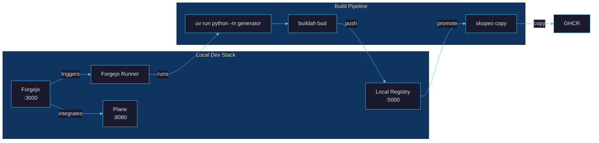

# Local Build Pipeline

Build, test, and promote container images using local Podman Quadlet services.
The default local workflow only starts the registry. Forgejo and Plane are
available, but opt-in.

## Architecture


```mermaid
%%{init: {'theme': 'base', 'themeVariables': {'primaryColor': '#1a1a2e', 'primaryTextColor': '#e0e0e0', 'primaryBorderColor': '#4fc3f7', 'lineColor': '#4fc3f7', 'secondaryColor': '#16213e', 'tertiaryColor': '#0f3460', 'edgeLabelBackground': '#1a1a2e'}}}%%
graph LR
    subgraph LOCAL["Local Dev Stack"]
        FG["Forgejo<br/>:3000"]
        RN["Forgejo Runner"]
        REG["Local Registry<br/>:5000"]
        PL["Plane<br/>:8080"]
    end

    subgraph BUILD["Build Pipeline"]
        GEN["uv run python -m generator"]
        BA["buildah bud"]
        SK["skopeo copy"]
    end

    FG -->|triggers| RN
    FG -->|integrates| PL
    RN -->|runs| GEN
    GEN --> BA
    BA -->|push| REG
    REG -->|promote| SK
    SK -->|copy| GH["GHCR"]
```

## Quadlet Files

All Quadlet definitions live in `overlays/deploy/`:

| File | Type | Purpose |
|------|------|---------|
| `forgejo.container` | Container | Self-hosted git forge (ports 3000, 2222) |
| `forgejo-db.container` | Container | Forgejo PostgreSQL backend |
| `forgejo-runner.container` | Container | Forgejo Actions CI runner |
| `exousia-registry.container` | Container | Local container registry (port 5000) |
| `freebsd.container` | Container | Standalone FreeBSD runtime container |
| `plane-*.container` | Container | Plane app, data services, and proxy (port 8080) |
| `forgejo-data.volume` | Volume | Persistent Forgejo data |
| `forgejo-db-data.volume` | Volume | Persistent Forgejo database data |
| `forgejo-runner-data.volume` | Volume | Persistent runner data |
| `exousia-registry-data.volume` | Volume | Persistent registry storage |
| `plane-*.volume` | Volume | Persistent Plane data services |
| `plane.env.example` | Template | Plane environment template |
| `exousia.network` | Network | Shared network (10.89.1.0/24) |

## Prerequisites

These tools are already included in the bootc image:

- **podman** -- container runtime and Quadlet host
- **buildah** -- OCI image builder
- **skopeo** -- image copy between registries
- **bats** -- integration test runner

## Setup

### Install and start Quadlet services

```bash
just quadlet-install
```

This copies all `.container`, `.volume`, and `.network` files to
`~/.config/containers/systemd/` and reloads systemd. Services are disabled
by default — use app-specific targets to start them.

### Optionally enable Forgejo and Plane later

```bash
# Forgejo
just forgejo-start

# Plane
just plane-install   # creates /etc/exousia/plane/plane.env from template
just plane-start     # starts plane-proxy (systemd pulls in all dependencies)
```

`just plane-install` copies the env template to `/etc/exousia/plane/plane.env`
and runs `quadlet-install`. `just plane-start` brings up the full Plane stack
on the shared Podman network so it can integrate with Forgejo by service name.

### Verify services are running

```bash
just plane-status
just forgejo-status

# Registry health check
curl -s localhost:5000/v2/

# Forgejo UI (optional)
curl -s -o /dev/null -w "%{http_code}" localhost:3000

# Plane UI (optional)
curl -s -o /dev/null -w "%{http_code}" localhost:8080
```

### Forgejo first-run setup

Only needed if you explicitly started Forgejo.

1. Open `http://localhost:3000` in a browser
2. Complete the initial configuration wizard
3. Create an admin account
4. Optionally mirror the GitHub repo:
   **Settings > Repository > Mirrors > Add Mirror**

### Register the Forgejo runner

Only needed if you explicitly started Forgejo.

1. In Forgejo, go to **Site Administration > Runners**
2. Copy the registration token
3. Set the token in the runner Quadlet:

```bash
systemctl --user stop forgejo-runner
# Edit ~/.config/containers/systemd/forgejo-runner.container
# Set: Environment=FORGEJO_RUNNER_TOKEN=<your-token>
systemctl --user daemon-reload
systemctl --user start forgejo-runner
```

## CI/CD Matrix Builds

The GitHub Actions pipeline builds the blueprint's `image-version` by default.
To build multiple Fedora versions in parallel, use workflow dispatch.
See [Matrix Builds](matrix-builds.md) for details.

## Build Workflow

### Build and push to local registry

```bash
just local-build              # tags as localhost:5000/exousia:latest
just local-build TAG=v1.2.3   # tags as localhost:5000/exousia:v1.2.3
```

This runs the full pipeline:

1. Generates a Containerfile from `adnyeus.yml`
2. Builds the image with `buildah`
3. Pushes to the local registry with `skopeo`

### Test the local image

```bash
just local-test               # runs bats tests against latest
just local-test TAG=v1.2.3    # runs bats tests against specific tag
```

### Publish to GHCR

```bash
just local-push               # copies latest to ghcr.io/borninthedark/exousia:latest
just local-push TAG=v1.2.3    # copies specific tag
```

### Mirror GHCR back into the local registry for bootc

```bash
just local-mirror             # copies latest from GHCR to localhost:5000/exousia:latest
just local-mirror TAG=v1.2.3  # copies specific tag
```

### Verify

```bash
# List images in local registry
curl -s localhost:5000/v2/_catalog

# List tags for a specific image
skopeo list-tags docker://localhost:5000/exousia --tls-verify=false
```

## Service Management

```bash
# Plane
just plane-install             # Copy quadlets + create env file
just plane-start               # Start Plane (systemd resolves full dep graph)
just plane-stop                # Stop the full Plane stack
just plane-status              # Show Plane service status
just plane-logs                # Follow Plane logs

# Forgejo
just forgejo-start             # Start Forgejo + runner
just forgejo-stop              # Stop Forgejo
just forgejo-status            # Show Forgejo service status
just forgejo-logs              # Follow Forgejo logs

# Standalone containers (pattern rules)
just start <name>              # Start any quadlet (e.g. just start freebsd)
just stop <name>               # Stop a standalone quadlet
just status <name>             # Show status of a standalone quadlet
just logs <name>               # Follow logs of a standalone quadlet

# Infrastructure
just quadlet-install           # Copy all quadlets to ~/.config/containers/systemd/
just quadlet-uninstall         # Remove the currently managed local stack quadlets and stop those services
```

## Plane + Forgejo

Plane is deployed on the shared `exousia.network` instead of a dedicated Plane
network. That is intentional: the Exousia local stack can treat Forgejo as the
authoritative SCM endpoint for project planning and delivery.

- from your browser, open Forgejo at `http://localhost:3000`
- from your browser, open Plane at `http://localhost:8080`
- from inside the Plane containers, use `http://forgejo:3000` when configuring
  Forgejo-backed integrations for the Exousia project

The Plane Quadlets follow the official Podman Quadlet startup order, adapted to
the shared Exousia network:

1. `exousia-network.service`
2. `plane-db.service`, `plane-redis.service`, `plane-mq.service`, `plane-minio.service`
3. `plane-api.service`, `plane-worker.service`, `plane-beat-worker.service`, `plane-migrator.service`
4. `plane-web.service`, `plane-space.service`, `plane-admin.service`, `plane-live.service`, `plane-proxy.service`

## Troubleshooting

### Registry connection refused

The registry listens on port 5000. Check it is running:

```bash
systemctl --user status exousia-registry
journalctl --user -u exousia-registry --no-pager -n 20
```

### Forgejo runner not connecting

The runner requires Forgejo to be healthy first (`Requires=forgejo.service`).
Verify:

```bash
systemctl --user status forgejo
systemctl --user status forgejo-runner
```

If the runner shows `inactive`, ensure `FORGEJO_RUNNER_TOKEN` is set in the
Quadlet file and reload:

```bash
systemctl --user daemon-reload
systemctl --user restart forgejo-runner
```

### Port conflicts

Default ports: Forgejo 3000/2222, Registry 5000. Check for conflicts:

```bash
ss -tlnp | grep -E '3000|2222|5000'
```

### Buildah permission errors

Rootless buildah requires `/etc/subuid` and `/etc/subgid` entries. Verify:

```bash
grep $(whoami) /etc/subuid
grep $(whoami) /etc/subgid
```

### Skopeo TLS errors

The local registry uses HTTP (no TLS). Skopeo commands include
`--tls-verify=false` / `--dest-tls-verify=false` / `--src-tls-verify=false`
for local registry operations.

---

**[Back to Documentation Index](README.md)** | **[Back to Main README](../README.md)**
