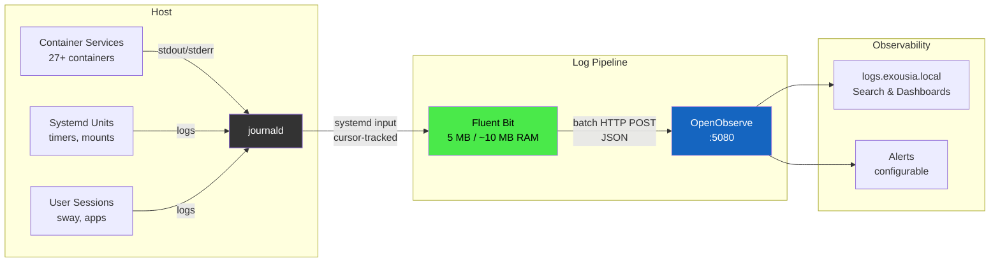

# Logging Architecture

Centralized log collection and observability for all Exousia services.

## Architecture



## Components

| Component | Role | Image | Port |
|---|---|---|---|
| **journald** | Log source — all systemd services write here | (system) | — |
| **Fluent Bit** | Log shipper — reads journal, batches, ships | `docker.io/fluent/fluent-bit:latest` | 2020 (metrics) |
| **OpenObserve** | Log storage, search, dashboards, alerts | `public.ecr.aws/zinclabs/openobserve:latest` | 5080 |

## Data Flow

1. All containers log to stdout/stderr → Podman routes to journald
2. Fluent Bit reads journald via the systemd input plugin (cursor-tracked)
3. Filters enrich logs: renames `CONTAINER_NAME` → `container`, strips noise
4. Batched HTTP POST every 5s to OpenObserve's `_json` endpoint
5. OpenObserve indexes, stores, and exposes via search UI

## Configuration Files

| File | Purpose |
|---|---|
| `overlays/deploy/fluent-bit.container` | Quadlet definition |
| `overlays/deploy/openobserve.container` | Quadlet definition |
| `~/.config/fluent-bit/fluent-bit.yaml` | Fluent Bit pipeline config |
| `~/.config/openobserve/openobserve.env` | OpenObserve credentials (mode 600) |

## Fluent Bit Details

### Container Requirements

Fluent Bit needs access to the host journal:

```ini
UserNS=keep-id
GroupAdd=keep-groups
SecurityLabelDisable=true
Volume=/var/log/journal:/var/log/journal:ro
```

- `UserNS=keep-id` — preserves host UID for journal access
- `GroupAdd=keep-groups` — inherits `systemd-journal` group membership
- `SecurityLabelDisable=true` — bypasses SELinux for journal reads
- Custom entrypoint: `Exec=/fluent-bit/bin/fluent-bit -c /fluent-bit/etc/fluent-bit.yaml`

### Pipeline (fluent-bit.yaml)

**Input:** `systemd` plugin reading `/var/log/journal` with cursor persistence at
`/var/log/fluent-bit/systemd.db` (volume-backed for restart resilience).

**Filters:**

- Rename fields: `CONTAINER_NAME` → `container`, `MESSAGE` → `message`, etc.
- Strip noisy metadata: `BOOT_ID`, `MACHINE_ID`, `SELINUX_CONTEXT`, etc.

**Output:** HTTP POST to `http://openobserve:5080/api/default/systemd/_json`

- Flush interval: 5 seconds
- Retry limit: 5
- Buffer: 50 MB disk-backed

### Credentials

Fluent Bit reads OpenObserve credentials from the shared env file:
`~/.config/openobserve/openobserve.env` (contains `ZO_ROOT_USER_EMAIL` and
`ZO_ROOT_USER_PASSWORD`).

## OpenObserve Details

### Access

- URL: `https://logs.exousia.local`
- No Authelia forward-auth (has own auth, same pattern as Beszel)
- Credentials in `~/.config/openobserve/openobserve.env`

### Streams

| Stream | Contents |
|---|---|
| `systemd` | All journald entries (containers + system services) |

Additional streams can be created by adding more Fluent Bit outputs with
different `uri` paths (e.g., `/api/default/containers/_json` for container-only).

## Image Policy

- `docker.io/fluent` — allowlisted in `~/.config/containers/policy.json`
- `public.ecr.aws/zinclabs` — allowlisted in `~/.config/containers/policy.json`

## Troubleshooting

```bash
# Check fluent-bit is shipping
podman logs fluent-bit --tail 5

# Verify OpenObserve receiving
curl -u "$email:$pass" http://localhost:5080/api/default/systemd/_json -d '[{"message":"test"}]' \
  -H "Content-Type: application/json"

# Check fluent-bit metrics
curl http://localhost:2020/api/v1/metrics

# Journal access issue: ensure host UID can read /var/log/journal
getfacl /var/log/journal/$(ls /var/log/journal)/
```

## READMEs to Review

The following docs may need updates to reflect the logging stack:

- `docs/quadlet-services.md` — add fluent-bit and openobserve
- `docs/README.md` — add logging/observability section
- `overlays/deploy/README.md` — if exists, add new quadlets
