# Quadlet Services

Comprehensive reference for all Podman Quadlet services in the Exousia local
development stack. All services share `exousia.network` (10.89.1.0/24) and are
opt-in — none start automatically unless explicitly enabled.

## Service Map

```mermaid
%%{init: {'theme': 'base', 'themeVariables': {'primaryColor': '#1a1a2e', 'primaryTextColor': '#e0e0e0', 'primaryBorderColor': '#4fc3f7', 'lineColor': '#4fc3f7', 'secondaryColor': '#16213e', 'tertiaryColor': '#0f3460'}}}%%
graph TD
    NET["exousia.network<br/>10.89.1.0/24"]

    subgraph INFRA["Infrastructure"]
        REG["Registry<br/>:5000"]
        BSD["FreeBSD<br/>(no port)"]
    end

    subgraph FORGEJO["Forgejo Stack"]
        FDB["forgejo-db<br/>postgres:14"]
        FG["Forgejo<br/>:3000/:2222"]
        FR["Forgejo Runner"]
    end

    subgraph AI["AI Stack"]
        OLL["Ollama<br/>:11434"]
        OWU["Open WebUI<br/>:3080"]
    end

    subgraph TEMPORAL["Temporal Stack"]
        TDB["temporal-db<br/>postgres:15"]
        TS["Temporal Server<br/>:7233"]
        TU["Temporal UI<br/>:8233"]
    end

    subgraph K3S["Kubernetes"]
        K3["K3s<br/>:6443/:80/:443"]
    end

    subgraph DOCS["Documentation"]
        BSDB["bookstack-db<br/>mariadb:11"]
        BS["BookStack<br/>:6875"]
    end

    subgraph DASH["Dashboard"]
        DY["Dashy<br/>:3030"]
    end

    subgraph PAPER["Paperless Stack"]
        PPDB["paperless-db<br/>postgres:18"]
        PPR["paperless-redis<br/>redis:8"]
        PP["Paperless-ngx<br/>:8000"]
    end

    subgraph IMMICH["Immich Stack"]
        IDB["immich-db<br/>postgres:14+pgvecto"]
        IR["immich-redis<br/>redis:8"]
        IML["immich-ml"]
        IM["Immich<br/>:2283"]
    end

    subgraph AUTH["Authentication"]
        AU["Authelia<br/>:9091"]
    end

    subgraph MON["Monitoring"]
        UK["Uptime Kuma<br/>:3001"]
        CD["changedetection<br/>:5001"]
    end

    subgraph VPN["VPN"]
        HS["Headscale<br/>:8080"]
    end

    NET --> REG
    NET --> BSD
    NET --> FDB --> FG --> FR
    NET --> OLL --> OWU
    NET --> K3
    NET --> TDB --> TS --> TU
    NET --> BSDB --> BS
    NET --> DY
    NET --> PPDB --> PP
    NET --> PPR --> PP
    NET --> IDB --> IM
    NET --> IR --> IM
    NET --> IML --> IM
    NET --> AU
    NET --> UK
    NET --> CD
    NET --> HS
```



## Service Groups

### Infrastructure (standalone)

| Service | Image | Host Port | Network Alias | Depends On |
|---------|-------|-----------|---------------|------------|
| `exousia-registry` | `registry:2` | 5000 | `registry` | `exousia.network` |
| `coredns` | `coredns/coredns:1.12.1` | 5354 (tcp+udp) | `coredns` | `exousia.network` |
| `caddy` | `caddy:2-alpine` | 80, 443 | `caddy` | `exousia.network`, `coredns` |
| `freebsd` | `freebsd/freebsd-runtime:14.4` | - | - | `exousia.network` |
| `k3s` | `rancher/k3s:latest` | 6443, 80, 443 | `k3s` | `exousia.network` |

Lifecycle: `just engage exousia-registry` / `just engage freebsd` / `just engage k3s`

K3s runs as a privileged container with `--disable=traefik` (use your own
ingress). kubeconfig is available at `k3s-data` volume or via
`podman exec k3s cat /etc/rancher/k3s/k3s.yaml`.

### Forgejo (git forge, 3 services)

| Service | Image | Host Port | Network Alias | Depends On |
|---------|-------|-----------|---------------|------------|
| `forgejo-db` | `postgres:14-alpine` | - | `forgejo-db` | `exousia.network` |
| `forgejo` | `forgejo/forgejo:14.0.2` | 3000, 2222 | `forgejo` | `forgejo-db` |
| `forgejo-runner` | `code.forgejo.org/forgejo/runner:9.1.1` | - | `forgejo-runner` | `forgejo`, `podman.socket` |

Lifecycle: `just engage forgejo` / `just disengage forgejo`

Dependency chain: `exousia.network` -> `forgejo-db` -> `forgejo` -> `forgejo-runner`

The runner requires `podman.socket` enabled (`systemctl --user enable --now
podman.socket`) and a one-time manual registration. Runner capacity is 3
(parallel jobs), each job container allocated 2 CPUs / 8GB RAM via
`container.options`, leaving 2 cores for the host. See [Forgejo Runner Setup](forgejo-runner.md) for full
setup instructions.

### AI (inference + chat, 2 services)

| Service | Image | Host Port | Network Alias | Depends On |
|---------|-------|-----------|---------------|------------|
| `ollama` | `ollama/ollama:latest` | 11434 | `ollama` | `exousia.network` |
| `open-webui` | `open-webui/open-webui:main` | 3080 | `open-webui` | `ollama` |

Lifecycle: `just engage ai` / `just disengage ai`

Dependency chain: `exousia.network` -> `ollama` -> `open-webui`

Open WebUI connects to Ollama via `http://ollama:11434` on the shared network.
Accessible at `https://ai.exousia.local`. First start creates the database
and requires admin account setup.

### Temporal (workflow orchestration, 3 services)

| Service | Image | Host Port | Network Alias | Depends On |
|---------|-------|-----------|---------------|------------|
| `temporal-db` | `postgres:15-alpine` | - | `temporal-db` | `exousia.network` |
| `temporal-server` | `temporalio/auto-setup:latest` | 7233 | `temporal` | `temporal-db` |
| `temporal-ui` | `temporalio/ui:latest` | 8233 | `temporal-ui` | `temporal-server` |

Lifecycle: `just engage temporal` / `just disengage temporal`

Dependency chain: `exousia.network` -> `temporal-db` -> `temporal-server` -> `temporal-ui`

The auto-setup image creates DB schemas on first boot. Workers connect to
`localhost:7233` (host) or `temporal:7233` (network).

### BookStack (documentation, 2 services)

| Service | Image | Host Port | Network Alias | Depends On |
|---------|-------|-----------|---------------|------------|
| `bookstack-db` | `mariadb:11` | - | `bookstack-db` | `exousia.network` |
| `bookstack` | `solidnerd/bookstack:24.12.1` | 6875 | `bookstack` | `bookstack-db` |

Lifecycle: `just engage bookstack` / `just remove bookstack`

Dependency chain: `exousia.network` -> `bookstack-db` -> `bookstack`

Accessible at `https://docs.exousia.local`. First start creates the database;
default admin credentials are `admin@admin.com` / `password` — change immediately.

### Paperless-ngx (document management, 3 services)

| Service | Image | Host Port | Network Alias | Depends On |
|---------|-------|-----------|---------------|------------|
| `paperless-db` | `postgres:18` | - | `paperless-db` | `exousia.network` |
| `paperless-redis` | `redis:8` | - | `paperless-redis` | `exousia.network` |
| `paperless` | `ghcr.io/paperless-ngx/paperless-ngx:latest` | 8000 | `paperless` | `paperless-db`, `paperless-redis` |

Lifecycle: `just engage paperless` / `just disengage paperless`

Dependency chain: `exousia.network` -> `paperless-db` + `paperless-redis` -> `paperless`

Accessible at `https://paperless.exousia.local`. First start requires creating a
superuser: `podman exec -it paperless python3 manage.py createsuperuser`.

### Immich (photo management, 4 services)

| Service | Image | Host Port | Network Alias | Depends On |
|---------|-------|-----------|---------------|------------|
| `immich-db` | `ghcr.io/immich-app/postgres:14-vectorchord` | - | `immich-db` | `exousia.network` |
| `immich-redis` | `redis:8` | - | `immich-redis` | `exousia.network` |
| `immich-ml` | `ghcr.io/immich-app/immich-machine-learning:release` | - | `immich-ml` | `immich-redis` |
| `immich` | `ghcr.io/immich-app/immich-server:release` | 2283 | `immich` | `immich-db`, `immich-redis` |

Lifecycle: `just engage immich` / `just disengage immich`

Dependency chain: `exousia.network` -> `immich-db` + `immich-redis` -> `immich-ml` -> `immich`

Accessible at `https://photos.exousia.local`. First start presents account creation.

### Uptime Kuma (monitoring, 1 service)

| Service | Image | Host Port | Network Alias | Depends On |
|---------|-------|-----------|---------------|------------|
| `uptime-kuma` | `louislam/uptime-kuma:2` | 3001 | `uptime-kuma` | `exousia.network` |

Lifecycle: `just engage uptime-kuma` / `just disengage uptime-kuma`

Accessible at `https://kuma.exousia.local`. First start creates admin account.

**Status page:** A public status page is available at `https://status.exousia.local`
(no SSO). Monitors use container DNS names (e.g. `http://forgejo:3000`) on the
shared `exousia.network`, grouped into Applications and Infrastructure. SMTP
notifications are configured via Proton Mail.

### Authelia (SSO authentication, 1 service)

| Service | Image | Host Port | Network Alias | Depends On |
|---------|-------|-----------|---------------|------------|
| `authelia` | `ghcr.io/authelia/authelia:latest` | 9091 | `authelia` | `exousia.network` |

Lifecycle: `just engage authelia` / `just disengage authelia`

Accessible at `https://auth.exousia.local`. Config at `~/.config/authelia/`.

**SSO integration:** All web UIs are protected via Caddy `forward_auth`. The
Caddyfile uses an `(authelia)` snippet imported per-site:

```caddyfile
(authelia) {
    forward_auth authelia:9091 {
        uri /api/authz/forward-auth
        copy_headers Remote-User Remote-Groups Remote-Email Remote-Name
    }
}
```

| Protected | Unprotected (no SSO) |
|-----------|---------------------|
| Forgejo, Paperless, Open WebUI, Temporal, BookStack, Dashy, Uptime Kuma, Immich, Headscale, changedetection | `auth.exousia.local` (self), `ollama.exousia.local` (API), `registry.exousia.local` (API) |

**SMTP notifications:** Proton Mail SMTP (`smtp.protonmail.ch:465`) via
`info@princetonstrong.online`. Token stored in `~/.config/authelia/smtp.env`
(loaded via `EnvironmentFile`). OTP codes for password resets are emailed.
Filesystem fallback (if SMTP is down): codes written to
`~/.config/authelia/notification.txt`.

**User database:** `~/.config/authelia/users_database.yml` (file-based, argon2
hashed passwords). Manage via Authelia web UI or edit the file directly.

**Config files (not in version control):**

| File | Purpose |
|------|---------|
| `~/.config/authelia/configuration.yml` | Main config (server, session, storage, notifier) |
| `~/.config/authelia/users_database.yml` | User accounts + hashed passwords |
| `~/.config/authelia/smtp.env` | Proton SMTP token |
| `~/.config/authelia/db.sqlite3` | Session/storage state |

### Headscale (VPN coordination, 1 service)

| Service | Image | Host Port | Network Alias | Depends On |
|---------|-------|-----------|---------------|------------|
| `headscale` | `ghcr.io/juanfont/headscale:latest` | 8080, 9090 | `headscale` | `exousia.network` |

Lifecycle: `just engage headscale` / `just disengage headscale`

Accessible at `https://headscale.exousia.local`. Config at `~/.config/headscale/`.
Self-hosted Tailscale control plane. Create users with
`podman exec headscale headscale users create <name>`.

### changedetection.io (website monitoring, 1 service)

| Service | Image | Host Port | Network Alias | Depends On |
|---------|-------|-----------|---------------|------------|
| `changedetection` | `ghcr.io/dgtlmoon/changedetection.io:latest` | 5001 | `changedetection` | `exousia.network` |

Lifecycle: `just engage changedetection` / `just disengage changedetection`

Accessible at `https://changes.exousia.local`. Monitors web pages for changes
with configurable check intervals and notifications.

## Port Summary

| Port | Service | Protocol |
|------|---------|----------|
| 2222 | Forgejo SSH | SSH |
| 3000 | Forgejo | HTTP |
| 3080 | Open WebUI | HTTP |
| 5000 | Container Registry | HTTP |
| 3001 | Uptime Kuma | HTTP |
| 3030 | Dashy | HTTP |
| 6875 | BookStack | HTTP |
| 7233 | Temporal Server | gRPC |
| 8000 | Paperless-ngx | HTTP |
| 8080 | Headscale | HTTP |
| 8233 | Temporal UI | HTTP |
| 9090 | Headscale metrics | HTTP |
| 9091 | Authelia | HTTP |
| 2283 | Immich | HTTP |
| 5001 | changedetection.io | HTTP |
| 6443 | K3s API Server | HTTPS |
| 11434 | Ollama | HTTP |

All ports bind to `127.0.0.1` only (no external exposure).

## Persistent Volumes

| Volume | Service | Mount Point |
|--------|---------|-------------|
| `exousia-registry-data` | Registry | `/var/lib/registry` |
| `forgejo-data` | Forgejo | `/data` |
| `forgejo-db-data` | Forgejo DB | `/var/lib/postgresql/data` |
| `forgejo-runner-data` | Forgejo Runner | `/data` |
| `k3s-data` | K3s | `/var/lib/rancher/k3s`, `/etc/rancher` |
| `ollama-data` | Ollama | `/root/.ollama` |
| `open-webui-data` | Open WebUI | `/app/backend/data` |
| `temporal-db-data` | Temporal DB | `/var/lib/postgresql/data` |
| `paperless-db-data` | Paperless DB | `/var/lib/postgresql` |
| `paperless-redis-data` | Paperless Redis | `/data` |
| `paperless-data` | Paperless-ngx | `/usr/src/paperless/data` |
| `paperless-media` | Paperless-ngx | `/usr/src/paperless/media` |
| `immich-db-data` | Immich DB | `/var/lib/postgresql/data` |
| `immich-redis-data` | Immich Redis | `/data` |
| `immich-ml-cache` | Immich ML | `/cache` |
| `immich-upload` | Immich | `/usr/src/app/upload` |
| `uptime-kuma-data` | Uptime Kuma | `/app/data` |
| `changedetection-data` | changedetection.io | `/datastore` |
| `headscale-data` | Headscale | `/var/lib/headscale` |
| `buildah-layers` | Forgejo Runner (job containers) | `/var/lib/containers/storage` |
| `caddy-data` | Caddy | `/data` (TLS certs + CA) |
| `caddy-config` | Caddy | `/config` (runtime config) |
| `bookstack-data` | BookStack | `/var/www/bookstack/storage/uploads` |
| `bookstack-files` | BookStack | `/var/www/bookstack/public/uploads` |
| `bookstack-db-data` | BookStack DB | `/var/lib/mysql` |

## Container Image Policy

The local machine's `/etc/containers/policy.json` uses a default-reject policy.
Each registry namespace must be explicitly allowlisted:

| Namespace | Required By |
|-----------|-------------|
| `docker.io/library` | postgres, mariadb, registry, caddy |
| `docker.io/solidnerd` | BookStack |
| `docker.io/ollama` | Ollama |
| `docker.io/temporalio` | Temporal server, Temporal UI |
| `docker.io/coredns` | CoreDNS |
| `codeberg.org/forgejo` | Forgejo |
| `code.forgejo.org/forgejo` | Forgejo Runner |
| `docker.io/catthehacker` | Forgejo Runner job containers (`ubuntu:act-latest`) |
| `docker.io/rancher` | K3s lightweight Kubernetes |
| `ghcr.io/borninthedark` | Exousia images (sigstore-signed) |
| `ghcr.io/gethomepage` | Homepage dashboard (disabled) |
| `ghcr.io/lissy93` | Dashy dashboard |
| `ghcr.io/paperless-ngx` | Paperless-ngx |
| `ghcr.io/immich-app` | Immich server, ML, postgres |
| `ghcr.io/authelia` | Authelia SSO |
| `ghcr.io/juanfont` | Headscale |
| `ghcr.io/dgtlmoon` | changedetection.io |
| `docker.io/louislam` | Uptime Kuma |
| `ghcr.io/open-webui` | Open WebUI |
| `quay.io/fedora` | Base image mirror for CI builds |
| `localhost:5000` | Local registry (`bootc switch`, skopeo) |

The build image's policy (`overlays/base/configs/containers/policy.json`)
allows all of `docker.io` and `quay.io` — no per-namespace rules needed there.

## Prerequisites: Networking & Storage

All quadlet services share a single Podman network and use named volumes for
persistent storage. Both are declared as quadlet unit files — systemd creates
them automatically when a dependent service starts.

### Network

The shared network is defined in `exousia.network` (quadlet `.network` file):

```ini
[Network]
NetworkName=exousia
Subnet=10.89.1.0/24
```

Every `.container` quadlet references this network:

```ini
Network=exousia.network:alias=<service-name>
```

The `:alias=` suffix registers the container's DNS name on the network, allowing
inter-container resolution (e.g., `forgejo` can reach `forgejo-db` by name).

### Volumes

Each service's persistent data lives in a named volume declared as a `.volume`
quadlet file (e.g., `forgejo-data.volume`). These files are minimal:

```ini
[Volume]
```

Containers reference them by filename:

```ini
Volume=forgejo-data.volume:/data
```

Systemd resolves `.volume` references to `podman volume create` calls on first
use. Data persists across container restarts and removals — only an explicit
`podman volume rm` destroys it.

### Login Linger

For user-scoped quadlets to run without an active login session:

```bash
loginctl enable-linger $USER
```

This is a one-time setup. Without it, all user services stop when you log out.

## Lifecycle Commands

All lifecycle commands are group-aware — pass a service group name to operate on
the entire stack, or a single service name for individual control.

```bash
# Quadlet lifecycle (works with groups or individual services)
just install <name>      # Copy files for reboot persistence (no start)
just engage <name>       # Install + start now
just disengage <name>    # Stop now, keep files (restarts on reboot)
just remove <name>       # Stop + delete files (opposite of install)
just report <name>       # Show systemd status
just logs <name>         # Follow journal logs
```

**Service groups:**

| Group | Expands To |
|-------|------------|
| `forgejo` | `forgejo-db`, `forgejo`, `forgejo-runner` |
| `ai` | `ollama`, `open-webui` |
| `temporal` | `temporal-db`, `temporal-server`, `temporal-ui` |
| `bookstack` | `bookstack-db`, `bookstack` |
| `paperless` | `paperless-db`, `paperless-redis`, `paperless` |
| `immich` | `immich-db`, `immich-redis`, `immich-ml`, `immich` |
| `dns` | `coredns`, `caddy` |

**Examples:**

```bash
just engage forgejo      # Install + start all 3 Forgejo services
just disengage ai        # Stop Ollama + Open WebUI
just logs temporal       # Follow logs for entire Temporal stack
just engage k3s          # Single service, no group expansion
```

**One-time setup commands:**

```bash
just dns-setup           # Trust Caddy CA + configure systemd-resolved
```

---

**[Back to Documentation Index](README.md)** | **[Back to Main README](../README.md)**
