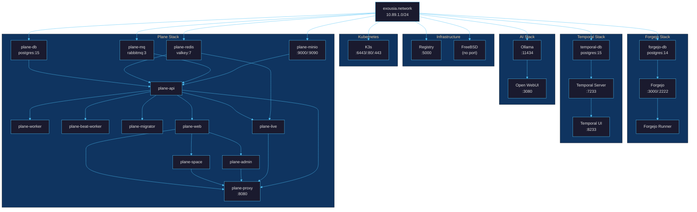

# Quadlet Services

Comprehensive reference for all Podman Quadlet services in the Exousia local
development stack. All services share `exousia.network` (10.89.1.0/24) and are
opt-in — none start automatically unless explicitly enabled.

## Service Map



## Service Groups

### Infrastructure (standalone)

| Service | Image | Host Port | Network Alias | Depends On |
|---------|-------|-----------|---------------|------------|
| `exousia-registry` | `registry:2` | 5000 | - | `exousia.network` |
| `freebsd` | `freebsd/freebsd-runtime:14.4` | - | - | `exousia.network` |
| `k3s` | `rancher/k3s:latest` | 6443, 80, 443 | `k3s` | `exousia.network` |

Lifecycle: `just engage exousia-registry` / `just engage freebsd` / `just engage k3s`

K3s runs as a privileged container with `--disable=traefik` (use your own
ingress). kubeconfig is available at `k3s-data` volume or via
`podman exec k3s cat /etc/rancher/k3s/k3s.yaml`.

### Forgejo (git forge, 3 services)

| Service | Image | Host Port | Network Alias | Depends On |
|---------|-------|-----------|---------------|------------|
| `forgejo-db` | `postgres:14-alpine` | - | `forgejo-db` | `exousia.network` |
| `forgejo` | `forgejo/forgejo:14.0.2` | 3000, 2222 | `forgejo` | `forgejo-db` |
| `forgejo-runner` | `code.forgejo.org/forgejo/runner:9.1.1` | - | `forgejo-runner` | `forgejo`, `podman.socket` |

Lifecycle: `just forgejo-start` / `just forgejo-stop`

Dependency chain: `exousia.network` -> `forgejo-db` -> `forgejo` -> `forgejo-runner`

The runner requires `podman.socket` enabled (`systemctl --user enable --now
podman.socket`) and a one-time manual registration. Runner capacity is 3
(parallel jobs), each job container allocated 2 CPUs / 8GB RAM via
`container.options`. See [Forgejo Runner Setup](forgejo-runner.md) for full
setup instructions.

### AI (inference + chat, 2 services)

| Service | Image | Host Port | Network Alias | Depends On |
|---------|-------|-----------|---------------|------------|
| `ollama` | `ollama/ollama:latest` | 11434 | `ollama` | `exousia.network` |
| `open-webui` | `open-webui/open-webui:main` | 3080 | `open-webui` | `ollama` |

Lifecycle: `just engage ollama` / `just engage open-webui`

Dependency chain: `exousia.network` -> `ollama` -> `open-webui`

Open WebUI connects to Ollama via `http://ollama:11434` on the shared network.
First start creates the database and requires admin account setup at
`http://localhost:3080`.

### Temporal (workflow orchestration, 3 services)

| Service | Image | Host Port | Network Alias | Depends On |
|---------|-------|-----------|---------------|------------|
| `temporal-db` | `postgres:15-alpine` | - | `temporal-db` | `exousia.network` |
| `temporal-server` | `temporalio/auto-setup:latest` | 7233 | `temporal` | `temporal-db` |
| `temporal-ui` | `temporalio/ui:latest` | 8233 | `temporal-ui` | `temporal-server` |

Lifecycle: `just temporal-start` / `just temporal-stop`

Dependency chain: `exousia.network` -> `temporal-db` -> `temporal-server` -> `temporal-ui`

The auto-setup image creates DB schemas on first boot. Workers connect to
`localhost:7233` (host) or `temporal:7233` (network).

### Plane (project management, 13 services)

| Service | Image | Host Port | Network Alias | Depends On |
|---------|-------|-----------|---------------|------------|
| `plane-db` | `postgres:15.7-alpine` | - | - | `exousia.network` |
| `plane-redis` | `valkey/valkey:7.2.5-alpine` | - | - | `exousia.network` |
| `plane-mq` | `rabbitmq:3.13.6-management-alpine` | 15672 | - | `exousia.network` |
| `plane-minio` | `minio/minio:latest` | 9000, 9090 | - | `exousia.network` |
| `plane-api` | `makeplane/plane-backend:stable` | - | `api` | db, redis, mq, minio |
| `plane-worker` | `makeplane/plane-backend:stable` | - | - | api, db, redis, mq, minio |
| `plane-beat-worker` | `makeplane/plane-backend:stable` | - | - | api, db, redis, mq, minio |
| `plane-migrator` | `makeplane/plane-backend:stable` | - | - | db, redis, mq, minio |
| `plane-web` | `makeplane/plane-frontend:stable` | - | `web` | api, worker |
| `plane-space` | `makeplane/plane-space:stable` | - | `space` | api, worker, web |
| `plane-admin` | `makeplane/plane-admin:stable` | - | `admin` | api, web |
| `plane-live` | `makeplane/plane-live:stable` | - | `live` | api, redis |
| `plane-proxy` | `makeplane/plane-proxy:stable` | 8080 | - | web, space, admin, live, api |

Lifecycle: `just plane-install` (first time) / `just plane-start` / `just plane-stop`

Dependency chain:

```text
exousia.network
  └─> plane-db, plane-redis, plane-mq, plane-minio  (data tier)
        └─> plane-api, plane-migrator                (backend tier)
              └─> plane-worker, plane-beat-worker     (async tier)
              └─> plane-web                           (frontend tier)
                    └─> plane-space, plane-admin       (sub-frontends)
              └─> plane-live                          (websocket)
                    └─> plane-proxy                   (reverse proxy)
```

Plane requires an env file at `/etc/exousia/plane/plane.env`. Run
`just plane-install` on first setup to create it from the template.

## Port Summary

| Port | Service | Protocol |
|------|---------|----------|
| 2222 | Forgejo SSH | SSH |
| 3000 | Forgejo | HTTP |
| 3080 | Open WebUI | HTTP |
| 5000 | Container Registry | HTTP |
| 7233 | Temporal Server | gRPC |
| 8080 | Plane Proxy | HTTP |
| 8233 | Temporal UI | HTTP |
| 9000 | Plane MinIO API | HTTP |
| 9090 | Plane MinIO Console | HTTP |
| 6443 | K3s API Server | HTTPS |
| 11434 | Ollama | HTTP |
| 15672 | Plane RabbitMQ Console | HTTP |

All ports bind to `127.0.0.1` only (no external exposure).

## Persistent Volumes

| Volume | Service | Mount Point |
|--------|---------|-------------|
| `exousia-registry-data` | Registry | `/var/lib/registry` |
| `forgejo-data` | Forgejo | `/data` |
| `forgejo-db-data` | Forgejo DB | `/var/lib/postgresql/data` |
| `forgejo-runner-data` | Forgejo Runner | `/data` |
| `k3s-data` | K3s | `/var/lib/rancher/k3s`, `/etc/rancher` |
| `ollama-data` | Ollama | `/root/.ollama` |
| `open-webui-data` | Open WebUI | `/app/backend/data` |
| `temporal-db-data` | Temporal DB | `/var/lib/postgresql/data` |
| `plane-db-data` | Plane DB | `/var/lib/postgresql/data` |
| `plane-redis-data` | Plane Redis | `/data` |
| `plane-mq-data` | Plane RabbitMQ | `/var/lib/rabbitmq` |
| `plane-minio-data` | Plane MinIO | `/data` |

## Container Image Policy

The local machine's `/etc/containers/policy.json` uses a default-reject policy.
Each registry namespace must be explicitly allowlisted:

| Namespace | Required By |
|-----------|-------------|
| `docker.io/library` | postgres, rabbitmq, registry |
| `docker.io/ollama` | Ollama |
| `docker.io/temporalio` | Temporal server, Temporal UI |
| `docker.io/makeplane` | Plane services |
| `docker.io/minio` | Plane MinIO |
| `docker.io/valkey` | Plane Redis (Valkey) |
| `codeberg.org/forgejo` | Forgejo |
| `code.forgejo.org/forgejo` | Forgejo Runner |
| `docker.io/catthehacker` | Forgejo Runner job containers (`ubuntu:act-latest`) |
| `docker.io/rancher` | K3s lightweight Kubernetes |
| `ghcr.io/borninthedark` | Exousia images (sigstore-signed) |
| `ghcr.io/open-webui` | Open WebUI |
| `quay.io/fedora` | Base image mirror for CI builds |

The build image's policy (`overlays/base/configs/containers/policy.json`)
allows all of `docker.io` and `quay.io` — no per-namespace rules needed there.

## Lifecycle Commands

```bash
# Individual services (any quadlet)
just engage <name>       # Copy files, reload systemd, start
just disengage <name>    # Stop, remove files, reload systemd
just start <name>        # Start (must be engaged)
just stop <name>         # Stop (keeps files)
just status <name>       # Show systemd status
just logs <name>         # Follow journal logs

# App-specific stacks
just forgejo-start       # Start Forgejo (3 services)
just forgejo-stop        # Stop Forgejo
just temporal-start      # Engage + start Temporal (3 services)
just temporal-stop       # Disengage Temporal
just plane-install       # First-time: create env file + install quadlets
just plane-start         # Start Plane (13 services)
just plane-stop          # Stop Plane

# Bulk operations
just quadlet-install     # Copy ALL quadlet files to systemd
just quadlet-uninstall   # Stop + remove ALL quadlets
```

---

**[Back to Documentation Index](README.md)** | **[Back to Main README](../README.md)**
