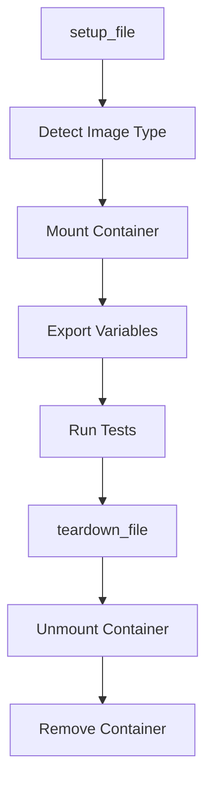

# Exousia Bootc Image Test Suite Documentation

## Table of Contents

1. [Overview](#overview)
2. [Architecture](#architecture)
3. [Test Categories](#test-categories)
4. [Running Tests](#running-tests)
5. [Writing New Tests](#writing-new-tests)
6. [Conditional Testing](#conditional-testing)
7. [Troubleshooting](#troubleshooting)
8. [CI/CD Integration](#cicd-integration)

---

## Overview

The Exousia bootc image test suite is a comprehensive, conditionally-aware testing framework built with [bats-core](https://bats-core.readthedocs.io/). It validates bootc container images across multiple dimensions while intelligently adapting to different base image types.

### Key Features

- **Conditional Testing**: Automatically detects image type and runs appropriate tests
- **Comprehensive Coverage**: 52+ tests covering packages, configurations, services, and security
- **Developer Friendly**: Clear assertions, helpful error messages, and easy debugging
- **CI/CD Ready**: Seamless GitHub Actions integration with proper cleanup
- **Flexible**: Supports both `fedora-bootc` and `fedora-sway-atomic` base images

---

## Architecture

### Test Framework Stack

```
┌─────────────────────────────────────┐
│   bats-core (Test Runner)           │
├─────────────────────────────────────┤
│   bats-support (Assertions)         │
│   bats-assert (Enhanced Assertions) │
│   bats-file (File System Helpers)   │
│   bats-detik (Kubernetes Testing)   │
├─────────────────────────────────────┤
│   Buildah (Container Inspection)    │
├─────────────────────────────────────┤
│   Container Image Under Test        │
└─────────────────────────────────────┘
```

### Test File Structure

```
tests/
└── image_content.bats    # Main test suite
    ├── setup_file()      # One-time setup before all tests
    ├── teardown_file()   # Cleanup after all tests
    └── @test blocks      # Individual test cases
```

### Test Lifecycle



---

## Test Categories

### 1. OS and Version Checks

**Purpose**: Validate operating system and Fedora version

**Tests**:
- Confirms OS is Fedora Linux
- Validates Fedora version (41-44 or rawhide)
- Verifies detected version matches expected range
- Checks BUILD_IMAGE_TYPE environment variable

**Example**:
```bash
@test "OS should be Fedora Linux" {
    run grep 'ID=fedora' "$MOUNT_POINT/etc/os-release"
    assert_success "Should be running Fedora Linux"
}
```

### 2. Container Authentication

**Purpose**: Validate container registry authentication setup

**Tests**:
- Verifies auth.json presence and content
- Checks ostree symlink configuration
- Validates tmpfiles.d configuration

**Conditional**: Only runs in CI environment

**Example**:
```bash
@test "Container auth files should be correctly configured in CI" {
    if [[ "${CI}" == "true" ]]; then
        assert_file_exists "$MOUNT_POINT/usr/lib/container-auth.json"
        # ... additional checks
    else
        skip "Auth file test is skipped outside of CI environment"
    fi
}
```

### 3. Package Lists and Plymouth

**Purpose**: Verify custom package management and boot splash

**Tests**:
- Package list files exist (packages.add, packages.remove, packages.sway)
- Plymouth theme properly installed
- Plymouth configuration files present
- Kernel arguments configured

**Example**:
```bash
@test "Custom Plymouth theme should be copied" {
    assert_dir_exists "$MOUNT_POINT/usr/share/plymouth/themes/bgrt-better-luks/"
    assert_file_exists "$MOUNT_POINT/usr/share/plymouth/themes/bgrt-better-luks/bgrt-better-luks.plymouth"
}
```

### 4. Custom Scripts

**Purpose**: Ensure custom scripts are present and executable

**Tests**:
- autotiling script
- config-authselect script
- lid script
- fedora-version-switcher script
- generate-readme script

**Example**:
```bash
@test "Custom script 'autotiling' should be executable" {
    assert_file_executable "$MOUNT_POINT/usr/local/bin/autotiling"
}
```

### 5. Repository Configuration

**Purpose**: Validate package repository setup

**Tests**:
- RPM Fusion repositories present and enabled
- Custom repositories configured (nwg-shell, swaylock-effects)
- Repository enablement status

**Example**:
```bash
@test "RPM Fusion repositories should be enabled" {
    run grep -E '^\s*enabled\s*=\s*1' "$MOUNT_POINT/etc/yum.repos.d/rpmfusion-free.repo"
    assert_success "RPM Fusion Free should be enabled"
}
```

### 6. Package Installation

**Purpose**: Verify all required packages are installed

**Test Groups**:

#### Core System Packages
- DNF5 with symlink
- bootc
- Systemd
- NetworkManager
- Podman

#### Desktop Environment
- Sway and components (waybar, swaylock)
- Conditional on image type

#### User Applications
- Terminal: kitty
- Editor: neovim
- Monitors: htop, btop
- File manager: ranger
- Container tools: distrobox

#### Audio and Media
- mpd (Music Player Daemon)
- pavucontrol (Volume Control)

#### Virtualization
- virt-manager
- qemu-kvm
- libvirt

#### Security
- pam-u2f
- lynis

**Example**:
```bash
@test "Audio and media packages should be installed" {
    run buildah run "$CONTAINER" -- rpm -q mpd
    assert_success "MPD should be installed"
    
    run buildah run "$CONTAINER" -- rpm -q pavucontrol
    assert_success "pavucontrol should be installed"
}
```

### 7. Package Removal Verification

**Purpose**: Confirm replaced packages are not present

**Tests**:
- foot (replaced by kitty)
- dunst (replaced by swaync)
- rofi-wayland (replaced by fuzzel)

### 8. Flatpak Configuration

**Purpose**: Verify Flatpak repository setup

**Tests**:
- Flathub remote added
- Correct repository URL
- Remote accessibility

### 9. Sway Configuration

**Purpose**: Validate Sway window manager setup

**Tests**:
- Configuration files present
- Greetd configuration valid
- Session files (conditional on fedora-bootc)
- Environment variables set correctly
- start-sway script properly configured

**Example**:
```bash
@test "Sway session files should be present for fedora-bootc base" {
    if [[ "$IMAGE_TYPE" == "fedora-bootc" ]]; then
        assert_file_exists "$MOUNT_POINT/usr/share/wayland-sessions/sway.desktop"
        assert_file_executable "$MOUNT_POINT/usr/bin/start-sway"
    else
        echo "# Skipping Sway session file checks for $IMAGE_TYPE" >&3
    fi
}
```

### 10. bootc Compliance

**Purpose**: Ensure image meets bootc requirements

**Tests**:
- bootc container lint passes
- ComposeFS enabled
- OSTree configuration valid

### 11. System Users and Groups

**Purpose**: Validate system user creation

**Tests**:
- greeter user exists with correct UID/GID
- greetd user exists
- rtkit user exists
- sysusers configuration present
- Home directories exist with proper permissions

**Example**:
```bash
@test "Greeter user should have correct UID/GID and shell" {
    run chroot "$MOUNT_POINT" getent passwd greeter
    assert_success
    echo "$output" | grep -Eq '^greeter:x:241:241:Greeter Login User:/var/lib/greeter:/sbin/nologin$'
    assert_success "greeter user should have UID/GID 241 and nologin shell"
}
```

### 12. Conditional Tests (Image Type Specific)

**Purpose**: Validate image-type-specific configurations

#### fedora-bootc Specific

**Directory Structure**:
- `/var/roothome` exists
- `/var/opt` exists
- `/usr/lib/extensions` exists
- `/opt` symlinks to `/var/opt`

**Service Enablement**:
- greetd.service enabled
- libvirtd.service enabled
- graphical.target is default

**Sway Installation**:
- Sway packages installed from packages.sway

**Example**:
```bash
@test "Directory structure should be correct for image type" {
    if [[ "$IMAGE_TYPE" == "fedora-bootc" ]]; then
        assert_dir_exists "$MOUNT_POINT/var/roothome"
        run readlink "$MOUNT_POINT/opt"
        assert_output "/var/opt" "/opt should point to /var/opt"
    else
        echo "# Skipping fedora-bootc specific directory checks for $IMAGE_TYPE" >&3
    fi
}
```

---

## Running Tests

### Prerequisites

```bash
# Install bats-core
git clone https://github.com/bats-core/bats-core.git
cd bats-core
sudo ./install.sh /usr/local

# Install bats libraries
git clone https://github.com/bats-core/bats-support test/test_helper/bats-support
git clone https://github.com/bats-core/bats-assert test/test_helper/bats-assert
git clone https://github.com/bats-core/bats-file test/test_helper/bats-file

# Install buildah
sudo dnf install buildah
```

### Local Execution

#### Using Make (Recommended)

```bash
# Build and test
make build test

# Test only (assumes image exists)
make test-run

# With specific image tag
TEST_IMAGE_TAG=localhost:5000/exousia:custom make test-run
```

#### Direct Execution

```bash
# Build image first
podman build -t localhost:5000/exousia:test .

# Run tests
export TEST_IMAGE_TAG=localhost:5000/exousia:test
buildah unshare -- bats -r tests/

# Verbose output
buildah unshare -- bats -r tests/ --verbose-run

# Tap output format
buildah unshare -- bats -r tests/ --formatter tap
```

### Test Specific Scenarios

#### Test fedora-bootc Build

```bash
# Switch to fedora-bootc
make switch-version VERSION=43 TYPE=fedora-bootc

# Build and test
make build test

# Verify conditional tests ran
# Look for: "✓ Directory structure should be correct for image type"
```

#### Test fedora-sway-atomic Build

```bash
# Switch to fedora-sway-atomic (or use default)
make switch-version VERSION=43 TYPE=fedora-sway-atomic

# Build and test
make build test

# Verify conditional tests skipped
# Look for: "# Skipping fedora-bootc specific directory checks"
```

### Debugging Failed Tests

#### Verbose Output

```bash
buildah unshare -- bats -r tests/ --verbose-run --show-output-of-passing-tests
```

#### Single Test Execution

```bash
# Run specific test by line number
buildah unshare -- bats tests/image_content.bats:42

# Run specific test by name (grep)
buildah unshare -- bats tests/image_content.bats --filter "Plymouth"
```

#### Interactive Debugging

```bash
# Mount container for inspection
export TEST_IMAGE_TAG=localhost:5000/exousia:test
CONTAINER=$(buildah from --pull-never "$TEST_IMAGE_TAG")
MOUNT_POINT=$(buildah mount "$CONTAINER")

# Inspect manually
ls -la "$MOUNT_POINT/usr/local/bin/"
chroot "$MOUNT_POINT" rpm -qa | grep sway

# Cleanup
buildah umount "$CONTAINER"
buildah rm "$CONTAINER"
```

---

## Writing New Tests

### Test Structure

```bash
@test "Descriptive test name" {
    # Arrange: Setup test data/conditions
    
    # Act: Perform action/check
    run command_to_test
    
    # Assert: Verify results
    assert_success "Helpful error message"
    assert_output "expected output"
}
```

### Best Practices

#### 1. Use Descriptive Names

```bash
# Good
@test "MPD should be installed and enabled"

# Bad
@test "check mpd"
```

#### 2. Provide Helpful Assertions

```bash
# Good
assert_success "pavucontrol should be installed for audio control"

# Bad
assert_success
```

#### 3. Use Appropriate Helpers

```bash
# File existence
assert_file_exists "$MOUNT_POINT/path/to/file"

# File executable
assert_file_executable "$MOUNT_POINT/usr/local/bin/script"

# Symlink validation
assert_symlink_to "$MOUNT_POINT/opt" "/var/opt"

# Directory existence
assert_dir_exists "$MOUNT_POINT/var/lib/greeter"
```

#### 4. Handle Conditional Logic

```bash
@test "Feature X should work for specific image type" {
    if [[ "$IMAGE_TYPE" == "fedora-bootc" ]]; then
        # Test fedora-bootc specific feature
        assert_file_exists "$MOUNT_POINT/some/file"
    else
        # Inform user test was skipped
        echo "# Skipping test for $IMAGE_TYPE" >&3
    fi
}
```

#### 5. Test Both Presence and Absence

```bash
@test "Replaced packages should NOT be installed" {
    run buildah run "$CONTAINER" -- rpm -q foot
    assert_failure "foot should be removed (replaced by kitty)"
}
```

### Example: Adding a New Package Test

```bash
@test "New package 'example-pkg' should be installed" {
    run buildah run "$CONTAINER" -- rpm -q example-pkg
    assert_success "example-pkg should be installed for feature X"
}

@test "New package 'example-pkg' should have correct configuration" {
    assert_file_exists "$MOUNT_POINT/etc/example-pkg/config.conf"
    
    run grep -q 'setting=value' "$MOUNT_POINT/etc/example-pkg/config.conf"
    assert_success "Configuration should contain 'setting=value'"
}
```

---

## Conditional Testing

### Overview

Conditional testing allows a single test suite to validate multiple image configurations without duplication.

### Detection Mechanism

```bash
setup_file() {
    # ... container setup ...
    
    # Detect image type from environment variable
    IMAGE_TYPE=$(buildah run "$CONTAINER" -- printenv BUILD_IMAGE_TYPE 2>/dev/null || echo "unknown")
    export IMAGE_TYPE
}
```

### Conditional Test Patterns

#### Pattern 1: Skip Non-Applicable Tests

```bash
@test "fedora-bootc specific feature" {
    if [[ "$IMAGE_TYPE" != "fedora-bootc" ]]; then
        skip "Only applicable to fedora-bootc base"
    fi
    
    # Test logic here
}
```

#### Pattern 2: Different Assertions Per Type

```bash
@test "Package configuration varies by type" {
    if [[ "$IMAGE_TYPE" == "fedora-bootc" ]]; then
        assert_file_exists "$MOUNT_POINT/path/for/bootc"
    else
        assert_file_exists "$MOUNT_POINT/path/for/sway-atomic"
    fi
}
```

#### Pattern 3: Informative Skip Messages

```bash
@test "Services enabled based on image type" {
    if [[ "$IMAGE_TYPE" == "fedora-bootc" ]]; then
        run buildah run "$CONTAINER" -- systemctl is-enabled greetd.service
        assert_success
    else
        echo "# Skipping service check for $IMAGE_TYPE (uses different defaults)" >&3
    fi
}
```

### When to Use Conditional Tests

**Use conditionals when:**
- Feature only exists in one base image
- Configuration differs significantly between types
- Installation location varies by base

**Avoid conditionals when:**
- Same test applies to both types
- Behavior should be identical
- Testing custom additions (not base image features)

---

## Troubleshooting

### Common Issues

#### Issue: "TEST_IMAGE_TAG environment variable is not set"

**Cause**: Required environment variable not exported

**Solution**:
```bash
export TEST_IMAGE_TAG=localhost:5000/exousia:latest
buildah unshare -- bats -r tests/
```

#### Issue: "Permission denied" when running tests

**Cause**: Tests need rootless container access via buildah

**Solution**:
```bash
# Always use buildah unshare
buildah unshare -- bats -r tests/
```

#### Issue: Tests pass locally but fail in CI

**Cause**: Environment differences (CI vs local)

**Solution**:
- Check CI environment variables
- Verify file permissions in artifact
- Review CI-specific conditionals

#### Issue: "Could not detect BUILD_IMAGE_TYPE"

**Cause**: Environment variable not set in container

**Solution**:
- Verify Containerfile sets `ENV BUILD_IMAGE_TYPE=${IMAGE_TYPE}`
- Check build args passed correctly
- Rebuild image with proper configuration

#### Issue: Conditional tests not skipping

**Cause**: Image type detection failing

**Debug**:
```bash
# Check detection
buildah run "$CONTAINER" -- printenv BUILD_IMAGE_TYPE

# Verify in test
@test "debug image type" {
    echo "Detected type: $IMAGE_TYPE" >&3
}
```

### Debug Strategies

#### 1. Enable Verbose Output

```bash
buildah unshare -- bats -r tests/ --verbose-run --show-output-of-passing-tests
```

#### 2. Add Debug Output

```bash
@test "debug test" {
    echo "IMAGE_TYPE=$IMAGE_TYPE" >&3
    echo "MOUNT_POINT=$MOUNT_POINT" >&3
    ls -la "$MOUNT_POINT/usr/local/bin/" >&3
}
```

#### 3. Run Single Test

```bash
buildah unshare -- bats tests/image_content.bats:100
```

#### 4. Manual Inspection

```bash
# Start container
CONTAINER=$(buildah from localhost:5000/exousia:test)
MOUNT_POINT=$(buildah mount "$CONTAINER")

# Inspect
chroot "$MOUNT_POINT" /bin/bash

# Cleanup
exit
buildah umount "$CONTAINER"
buildah rm "$CONTAINER"
```

---

## CI/CD Integration

### GitHub Actions Configuration

The test suite integrates with GitHub Actions via the workflow:

```yaml
- name: Run Bats tests on the bootc image
  shell: bash
  env:
    BATS_LIB_PATH: ${{ steps.setup-bats.outputs.lib-path }}
    TERM: xterm
  run: |
    FIRST_TAG=$(echo "${{ steps.meta.outputs.tags }}" | head -n1)
    TEST_IMAGE_TAG="$FIRST_TAG" buildah unshare -- bats -r tests
```

### CI Environment Variables

Tests have access to:
- `CI=true` - Indicates CI environment
- `TEST_IMAGE_TAG` - Image to test
- `BATS_LIB_PATH` - Bats library location
- `GITHUB_*` - GitHub-specific variables

### Test Results

#### Success

```
✓ OS should be Fedora Linux
✓ Package installation verified
...
52 tests, 0 failures
```

#### Failure

```
✗ Package 'example' should be installed
  (in test file tests/image_content.bats, line 234)
  `assert_success "example should be installed"' failed
  
  -- command failed --
  status : 1
  output : package example is not installed
```

### Workflow Integration Points

1. **Pre-Build**: Verify file structure
2. **Post-Build**: Run test suite
3. **On Failure**: Provide clear error messages
4. **On Success**: Continue to push/sign

---

## Test Maintenance

### Adding Tests for New Features

1. **Identify test category**
2. **Write test following patterns**
3. **Add conditional logic if needed**
4. **Verify locally for both image types**
5. **Update documentation**

### Deprecating Old Tests

1. **Mark as deprecated in comments**
2. **Change assertion to skip**
3. **Add deprecation notice**
4. **Remove after transition period**

### Updating for New Fedora Versions

```bash
# Update version checks
@test "OS version should match expected Fedora versions (41–45 or rawhide)" {
    run grep -E 'VERSION_ID=(41|42|43|44|45)' "$MOUNT_POINT/etc/os-release"
    # ...
}
```

---

## Performance Considerations

### Test Execution Time

- Average: 30-45 seconds
- With slow RPM queries: up to 2 minutes
- Parallelization: Not currently supported (shared container mount)

### Optimization Tips

1. **Group related checks**
2. **Cache mount point access**
3. **Minimize chroot calls**
4. **Use efficient grep patterns**

---

## Contributing

### Adding New Test Categories

1. Add section header comment
2. Group related tests
3. Follow naming conventions
4. Provide clear assertions
5. Update documentation

### Review Checklist

- [ ] Tests pass locally
- [ ] Tests pass for both image types
- [ ] Conditional logic verified
- [ ] Clear error messages
- [ ] Documentation updated
- [ ] Follows established patterns

---

## References

- [bats-core Documentation](https://bats-core.readthedocs.io/)
- [Buildah Documentation](https://buildah.io/)
- [Fedora bootc Guide](https://docs.fedoraproject.org/en-US/bootc/)
- [Project Repository](https://github.com/yourusername/exousia)